Built-in checks
===============

All built-in checks are importable from :mod:`traits_audit.checks`.

.. code-block:: python

   from traits_audit.checks import (
       CalibrationErrorCheck,
       ConformalCoverageCheck,
       CRPSCheck,
       NegativeLogLikelihoodCheck,
       PITUniformityCheck,
       IntervalScoreCheck,
       IntervalCoverageCheck,
       VarianceAlignmentCheck,
       UncertaintyEvolutionCheck,
       UncertaintyAnomalyCheck,
       VarianceErrorCorrelationCheck,
       LyapunovStabilityCheck,
       MahalanobisOODCheck,
   )

Summary table
-------------

.. list-table::
   :header-rows: 1
   :widths: 30 20 25 25

   * - Check
     - Category
     - What it measures
     - Required data
   * - :class:`~traits_audit.checks.CalibrationErrorCheck`
     - ``aleatoric_model``
     - Kuleshov (2018) mean calibration error
     - ``y_true``, ``y_pred_mean``, ``y_pred_std``
   * - :class:`~traits_audit.checks.ConformalCoverageCheck`
     - ``aleatoric_model``
     - Distribution-free marginal coverage validity (Angelopoulos & Bates 2021)
     - ``y_true``, ``y_pred_mean``, ``y_pred_std``
   * - :class:`~traits_audit.checks.CRPSCheck`
     - ``aleatoric_model``
     - Continuous Ranked Probability Score — proper scoring rule rewarding calibration and sharpness (Gneiting & Raftery 2007)
     - ``y_true``, ``y_pred_mean``, ``y_pred_std``
   * - :class:`~traits_audit.checks.NegativeLogLikelihoodCheck`
     - ``aleatoric_model``
     - Gaussian negative log-likelihood — proper scoring rule penalising overconfident and over-dispersed forecasts (Good 1952)
     - ``y_true``, ``y_pred_mean``, ``y_pred_std``
   * - :class:`~traits_audit.checks.PITUniformityCheck`
     - ``aleatoric_model``
     - KS test for PIT uniformity — distributional calibration gold standard (Dawid 1984)
     - ``y_true``, ``y_pred_mean``, ``y_pred_std``
   * - :class:`~traits_audit.checks.IntervalScoreCheck`
     - ``aleatoric_model``
     - Winkler interval score — proper scoring rule jointly penalising non-coverage and excessive width (Winkler 1972)
     - ``y_true``, ``y_pred_mean``, ``y_pred_std``
   * - :class:`~traits_audit.checks.IntervalCoverageCheck`
     - ``aleatoric_model``
     - Empirical 1-σ coverage vs expected 68.3 %
     - ``y_true``, ``y_pred_mean``, ``y_pred_std``
   * - :class:`~traits_audit.checks.VarianceAlignmentCheck`
     - ``aleatoric_model``
     - Ratio of mean predicted variance to mean empirical squared error
     - ``y_true``, ``y_pred_mean``, ``y_pred_std``
   * - :class:`~traits_audit.checks.UncertaintyEvolutionCheck`
     - ``epistemic``
     - Relative slope of uncertainty over iterations
     - ``uncertainties`` kwarg or per-step ``uncertainty``
   * - :class:`~traits_audit.checks.UncertaintyAnomalyCheck`
     - ``epistemic``
     - Fraction of steps with z-score above threshold
     - ``uncertainties`` kwarg or per-step ``uncertainty``
   * - :class:`~traits_audit.checks.VarianceErrorCorrelationCheck`
     - ``epistemic``
     - Spearman rho between predicted std and absolute error
     - ``y_true``, ``y_pred_mean``, ``y_pred_std``
   * - :class:`~traits_audit.checks.LyapunovStabilityCheck`
     - ``epistemic``
     - Fraction of operating points with :math:`|\lambda_{\max}|` < stability threshold
     - ``lambda_max`` kwarg / history key, or ``surrogate_fn`` + ``op_states``
   * - :class:`~traits_audit.checks.MahalanobisOODCheck`
     - ``epistemic``
     - Fraction of recent steps out-of-distribution, cross-checked against calibrated uncertainty for suppression
     - ``op_states`` kwarg; optional ``uncertainties`` kwarg or per-step ``uncertainty``

Calibration checks
------------------

Calibration error
~~~~~~~~~~~~~~~~~

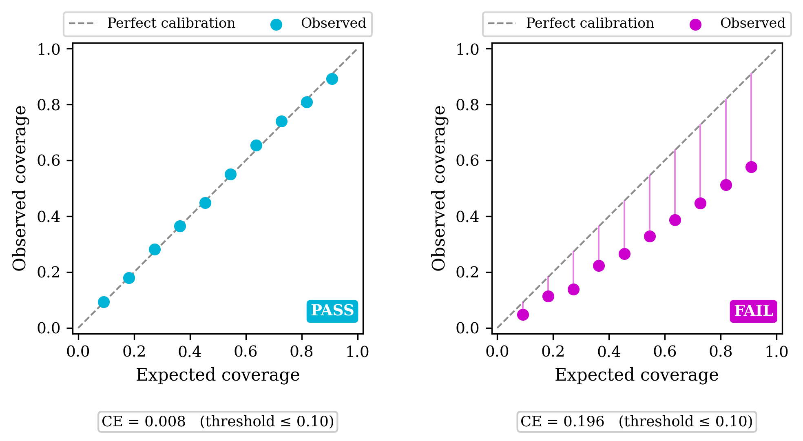

   Calibration error is the area between the collected data scatter plot
   and the parity line. (Left) Example with minimal calibration error. (Right)
   Example with high calibration error.

.. autoclass:: traits_audit.checks.CalibrationErrorCheck
   :members:
   :no-index:

Interval coverage
~~~~~~~~~~~~~~~~~

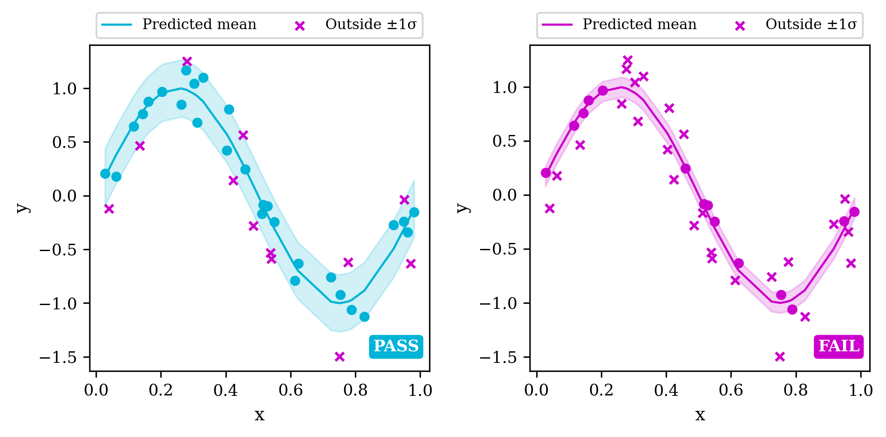

   Interval coverage checks that most points are within the variance of the
   model. (Left) Example of passing interval coverage. (Right) Example of
   failing interval coverage.

.. autoclass:: traits_audit.checks.IntervalCoverageCheck
   :members:
   :no-index:

Variance alignment
~~~~~~~~~~~~~~~~~~

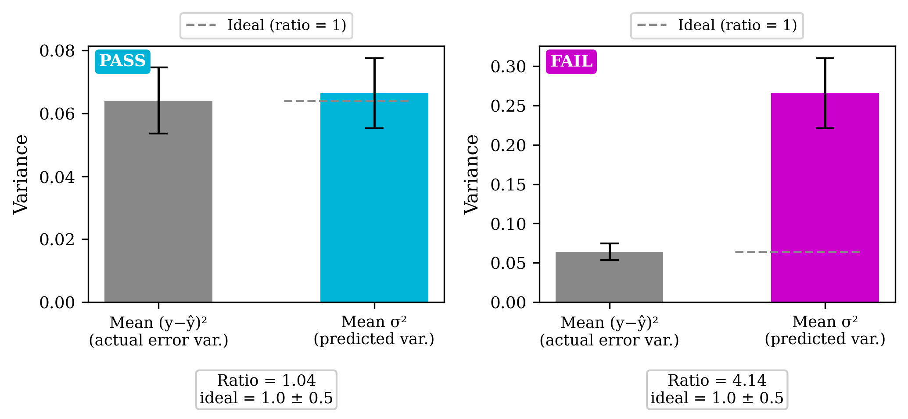

   The variance and error should agree. (Left) Example of agreement between the
   predicted variance and the mean empirical squared error. (Right) Example of
   disagreement between predicted variance and mean empirical squared error.

.. autoclass:: traits_audit.checks.VarianceAlignmentCheck
   :members:
   :no-index:

Conformal prediction coverage
~~~~~~~~~~~~~~~~~~~~~~~~~~~~~~

Unlike the parametric calibration checks above, ``ConformalCoverageCheck``
makes no distributional assumption.  It applies split conformal prediction
(Vovk, Gammerman & Shafer 2005; Angelopoulos & Bates 2021) to verify that
prediction intervals achieve valid marginal coverage at a user-specified
target level.

The key diagnostic quantity is the conformal quantile **q-hat** -- the factor
by which sigma must be scaled so that the interval ``[y-hat +/- q-hat * sigma]``
covers the true value with probability >= 1 - alpha.  Comparing q-hat to the
expected Gaussian critical value ``z_{1-alpha/2}`` reveals the calibration
state at a glance:

* **q-hat / z approx 1** -- model is well-calibrated; parametric intervals are valid.
* **q-hat / z > 1** -- model is overconfident; intervals need widening.
* **q-hat / z < 1** -- model is over-dispersed; intervals are unnecessarily wide.

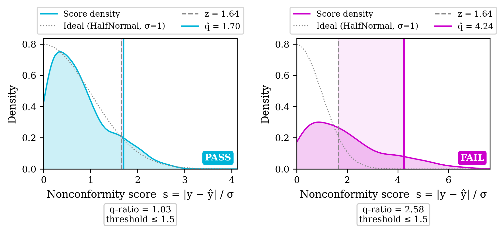

   Nonconformity score distributions s = abs(y - y_hat) / sigma for (Left) a
   well-calibrated model where q-hat aligns with the expected Gaussian critical
   value z (ratio approx 1, PASS) and (Right) an overconfident model where sigma
   is too small, pushing q-hat well above z (ratio >> 1, FAIL). The shaded region
   highlights the gap between z and q-hat.

.. autoclass:: traits_audit.checks.ConformalCoverageCheck
   :members:
   :no-index:

Proper scoring rules
--------------------

The four checks in this section are **proper scoring rules** — metrics that
simultaneously reward calibration *and* sharpness and cannot be gamed by
inflating prediction intervals.  A proper scoring rule is minimised (for
lower-is-better metrics) only when the forecaster reports their true belief,
making it impossible to achieve a good score by hedging with wide intervals.
These checks fill the gap left by coverage-only diagnostics.

CRPS
~~~~

The Continuous Ranked Probability Score (CRPS) is arguably the most widely
used proper scoring rule in probabilistic forecasting.  For a Gaussian
predictive distribution :math:`\mathcal{N}(\mu_i, \sigma_i^2)` and observation
:math:`y_i`, the closed-form expression is:

.. math::

   \text{CRPS}_i = \sigma_i \left[
       2\phi(z_i) + z_i\bigl(2\Phi(z_i) - 1\bigr) - \frac{1}{\sqrt{\pi}}
   \right], \quad z_i = \frac{y_i - \mu_i}{\sigma_i}

where :math:`\phi` and :math:`\Phi` are the standard-normal PDF and CDF.
A perfectly calibrated Gaussian model achieves
:math:`\mathbb{E}[\text{CRPS}] \approx \sigma / \sqrt{\pi} \approx 0.564 \cdot \sigma`.
Overconfident models (small :math:`\sigma`) incur large :math:`z^2` terms while
over-dispersed models (large :math:`\sigma`) are penalised through the width term.

.. note::

   CRPS is scale-dependent (proportional to :math:`\sigma`).  The default
   ``threshold=None`` means the check always passes and reports the value for
   monitoring and trending.  Set a problem-specific threshold to enable
   pass/fail detection.

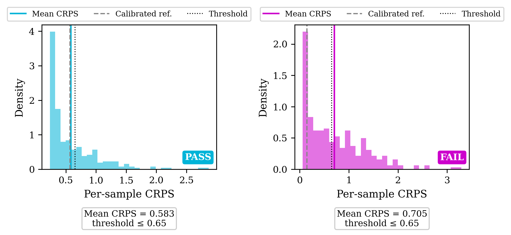

   CRPS distributions for (Left) a well-calibrated model where mean CRPS
   is close to the calibrated reference sigma/sqrt(pi) and (Right) an
   overconfident model where sigma is too small, inflating CRPS toward the
   mean absolute error.

.. autoclass:: traits_audit.checks.CRPSCheck
   :members:
   :no-index:

Negative log-likelihood
~~~~~~~~~~~~~~~~~~~~~~~

The Gaussian negative log-likelihood (NLL) is the most commonly reported
proper scoring rule in the machine learning uncertainty quantification
literature.  For :math:`\mathcal{N}(\mu_i, \sigma_i^2)`:

.. math::

   \text{NLL}_i = \tfrac{1}{2}\log(2\pi) + \log(\sigma_i)
                + \tfrac{1}{2}\!\left(\frac{y_i - \mu_i}{\sigma_i}\right)^2

NLL is more sensitive to overconfidence than CRPS: underestimating
:math:`\sigma` incurs an unbounded log penalty.  A calibrated Gaussian model
with unit residuals achieves NLL :math:`\approx 0.5 \log(2\pi) + 0.5 \approx 1.42`.

.. note::

   Like CRPS, NLL is scale-dependent.  The default ``threshold=None`` means
   the check always passes and reports the value for monitoring and trending.

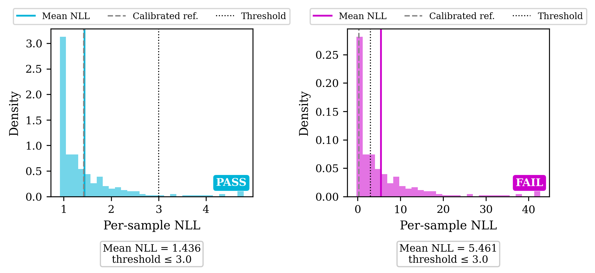

   NLL distributions for (Left) a well-calibrated model where mean NLL is
   close to the calibrated reference and (Right) an overconfident model where
   the large squared z-terms drive NLL far above the reference.

.. autoclass:: traits_audit.checks.NegativeLogLikelihoodCheck
   :members:
   :no-index:

PIT uniformity
~~~~~~~~~~~~~~

The Probability Integral Transform (PIT) test is the distributional
calibration gold standard.  For a Gaussian predictive distribution, the PIT
value is:

.. math::

   U_i = \Phi\!\left(\frac{y_i - \mu_i}{\sigma_i}\right)

If the model is correctly specified, :math:`U_1, \ldots, U_n` are i.i.d.
:math:`\text{Uniform}(0, 1)`.  This check applies a one-sample
Kolmogorov–Smirnov test and **passes if the p-value** :math:`\geq \alpha`
(null hypothesis of uniformity is not rejected).

The PIT test is strictly more powerful than marginal-coverage checks: it
detects asymmetric miscalibration, systematic bias, and distributional
shape errors that leave marginal coverage intact.

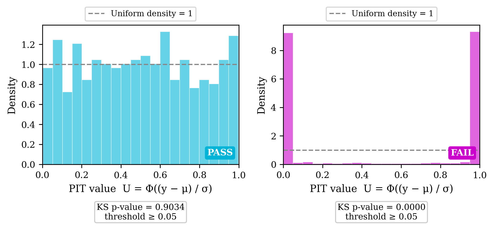

   PIT histograms for (Left) a well-calibrated model where PIT values are
   approximately uniform (PASS) and (Right) an overconfident model where
   PIT values are concentrated near 0 and 1, indicating the predictive
   distribution is too narrow (FAIL).

.. autoclass:: traits_audit.checks.PITUniformityCheck
   :members:
   :no-index:

Interval score
~~~~~~~~~~~~~~

The Winkler interval score is a proper scoring rule for interval forecasts.
For a prediction interval :math:`[l_i, u_i]` at nominal coverage
:math:`1 - \alpha`, constructed as
:math:`[\mu_i \pm z_{1-\alpha/2}\, \sigma_i]`:

.. math::

   \text{IS}_i = (u_i - l_i)
     + \frac{2}{\alpha}\max(l_i - y_i,\, 0)
     + \frac{2}{\alpha}\max(y_i - u_i,\, 0)

The score penalises unnecessary width through the :math:`(u-l)` term and
coverage failures through the penalty terms.  A well-calibrated model is
rewarded for producing tight intervals — in contrast to coverage-only checks
that can be satisfied trivially by very wide intervals.

.. note::

   Interval Score is scale-dependent.  The default ``threshold=None`` means
   the check always passes and reports the value for monitoring and trending.

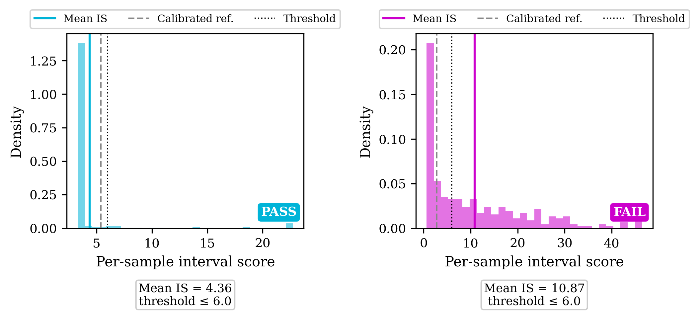

   Interval score distributions for (Left) a well-calibrated model with
   tight, well-covering intervals (low IS, PASS) and (Right) an overconfident
   model whose narrow intervals incur heavy coverage penalties (high IS, FAIL).

.. autoclass:: traits_audit.checks.IntervalScoreCheck
   :members:
   :no-index:

Uncertainty evolution checks
-----------------------------

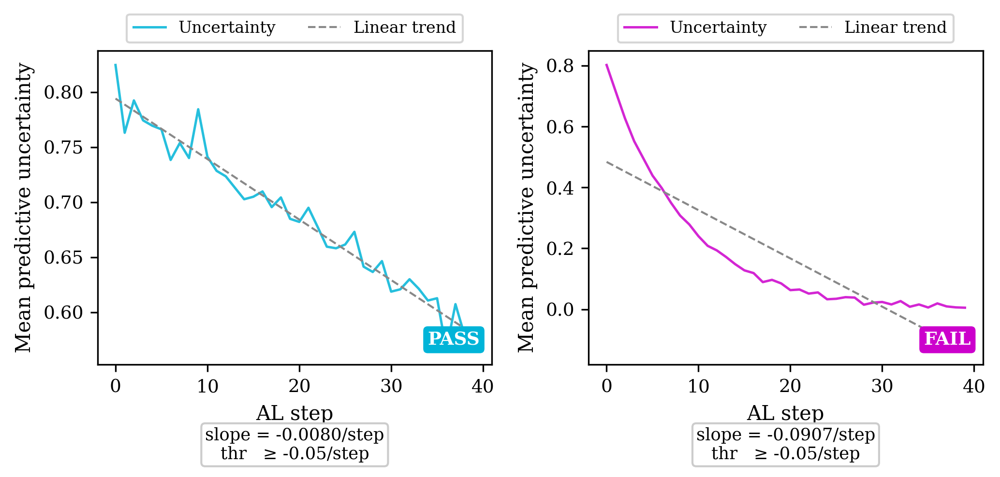

   Imposes a linear constraint on how uncertainty changes as the system evolves. Example
   shown is for updates during active learning (AL). (Left) Uncertainty decreases linearly
   as more data is acquired. (Right) Uncertainty decreases monotonically but not linearly.

.. autoclass:: traits_audit.checks.UncertaintyEvolutionCheck
   :members:
   :no-index:

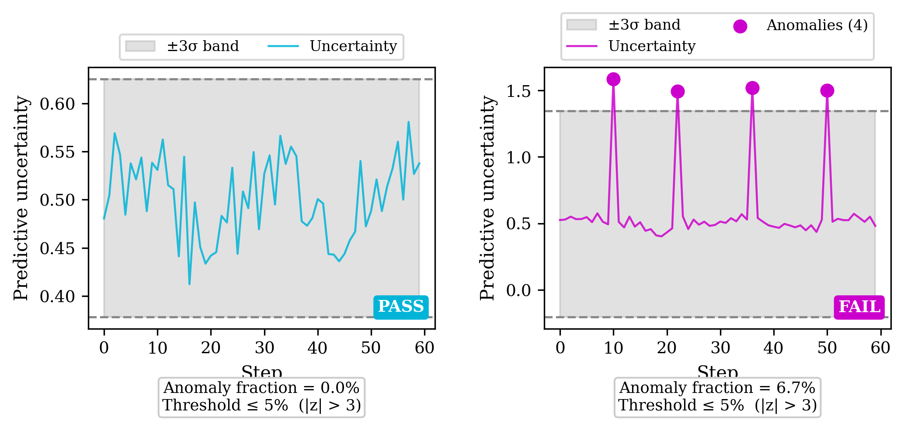

   Requires that uncertainty estimates stay within 3 sigma of the mean uncertainty.
   (Left) Example with no uncertainty anomalies. (Right) Example with multiple anomalies.

.. autoclass:: traits_audit.checks.UncertaintyAnomalyCheck
   :members:
   :no-index:

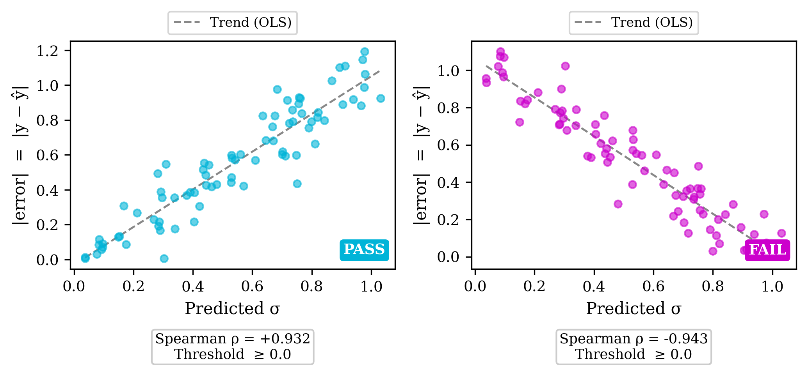

   Requires that the predicted variance is positively correlated with the empirical error.
   (Left) Example with positive correlation between predicted variance and absolute error.
   (Right) Example with negative correlation between predicted variance and absolute error.

.. autoclass:: traits_audit.checks.VarianceErrorCorrelationCheck
   :members:
   :no-index:

Lyapunov stability check
------------------------

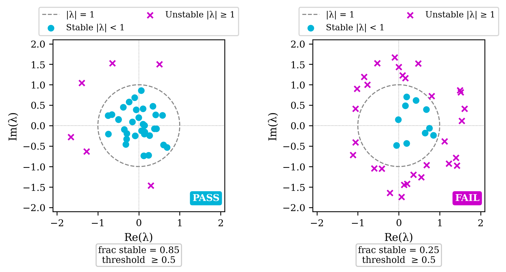

   Requires that the maximum eigenvalue of the Jacobian is less than a threshold. (Left) Example
   with all operating points having :math:`|\lambda_{\max}|` < 1. (Right) Example with some operating
   points having :math:`|\lambda_{\max}|` > 1.

"Local" is used in two distinct senses across this check and its documentation
— worth disambiguating explicitly:

- **Spatial locality** (per operating point): each :math:`\lambda_{\max}` comes
  from linearizing the surrogate's gradient-descent map *at one operating
  point* — a local property of the landscape there, not a global convergence
  guarantee for the whole surface. This is the sense used when case-study docs
  say a check "determines local stability."
- **Temporal locality** (recent vs. cumulative), controlled by ``window``:
  ``window=None`` (the default) aggregates the stable fraction over the
  *entire* history — a global, whole-run verdict that dilutes recent behavior
  with everything queried since step 0. Setting ``window=M`` restricts the
  verdict to the *last M* operating points, so it reflects the model's
  *current* operating region instead. The two senses are independent: a
  cumulative (``window=None``) verdict is still built from per-point (spatially
  local) Jacobians; setting a window just changes how many of those per-point
  results get aggregated into the reported fraction.

.. autoclass:: traits_audit.checks.LyapunovStabilityCheck
   :members:
   :no-index:

Mahalanobis OOD check
----------------------

Flags queries that are both far from the training distribution (in
parameter space) and reported with suppressed — rather than elevated —
calibrated uncertainty, a dangerous combination for irreversible
experiments. OOD activity by itself is expected during active learning;
this check only fails when the model is confidently wrong exactly where
it is extrapolating.

.. autoclass:: traits_audit.checks.MahalanobisOODCheck
   :members:
   :no-index:

Uncertainty categories
----------------------

.. autoclass:: traits_audit.base.AuditCategory
   :members:
   :no-index:

.. list-table::
   :header-rows: 1
   :widths: 30 70

   * - Value
     - Meaning
   * - ``aleatoric_irreducible``
     - Cannot be reduced by collecting more data (measurement noise,
       process stochasticity)
   * - ``aleatoric_model``
     - Calibration mismatch -- the model's stated uncertainty does not
       match empirical coverage
   * - ``epistemic``
     - Reducible uncertainty -- shrinks as more observations are collected
   * - ``unknown``
     - Source not yet characterised
