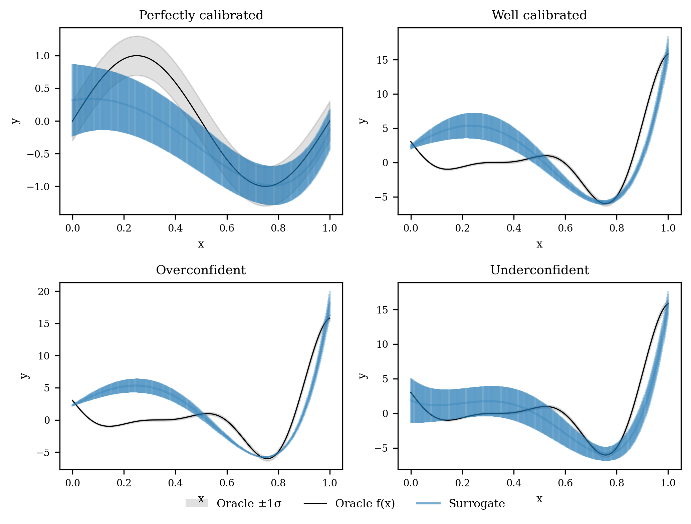
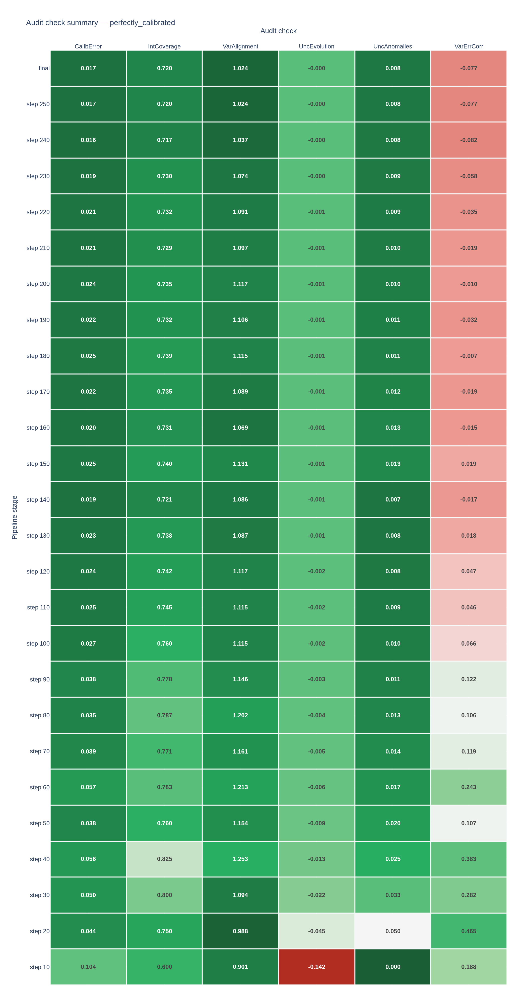
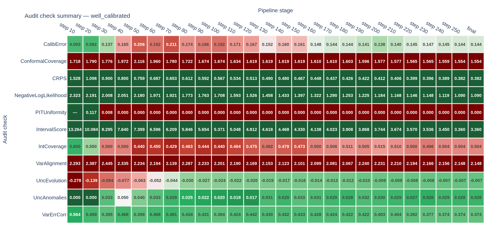
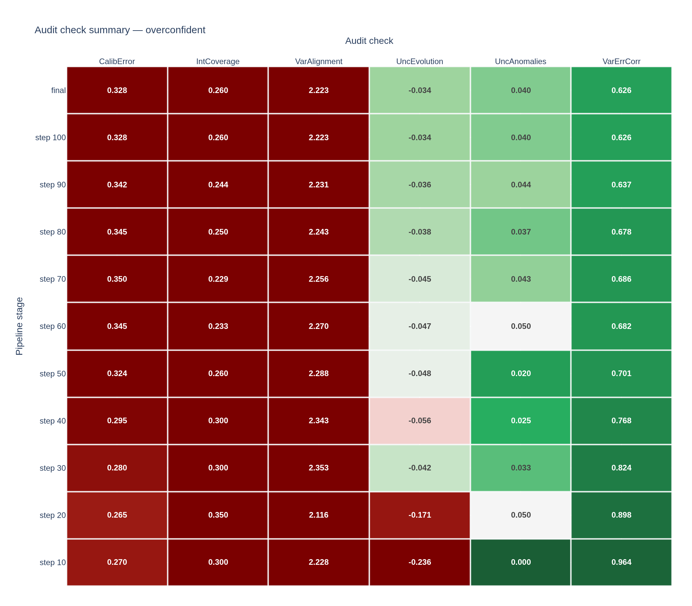
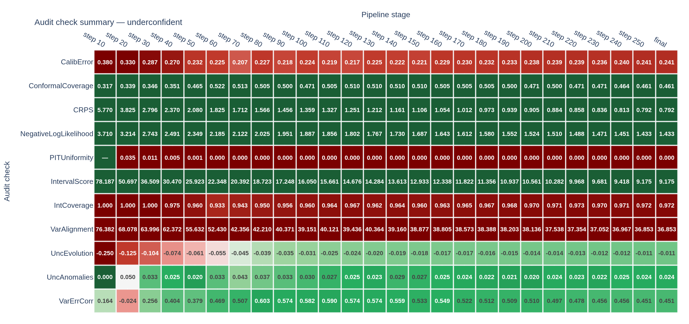
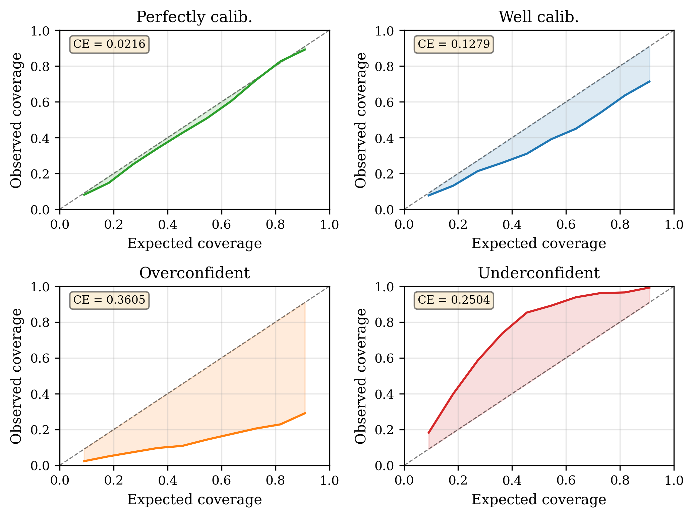
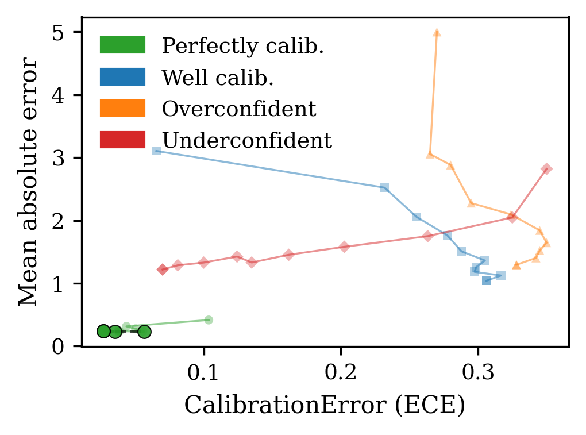
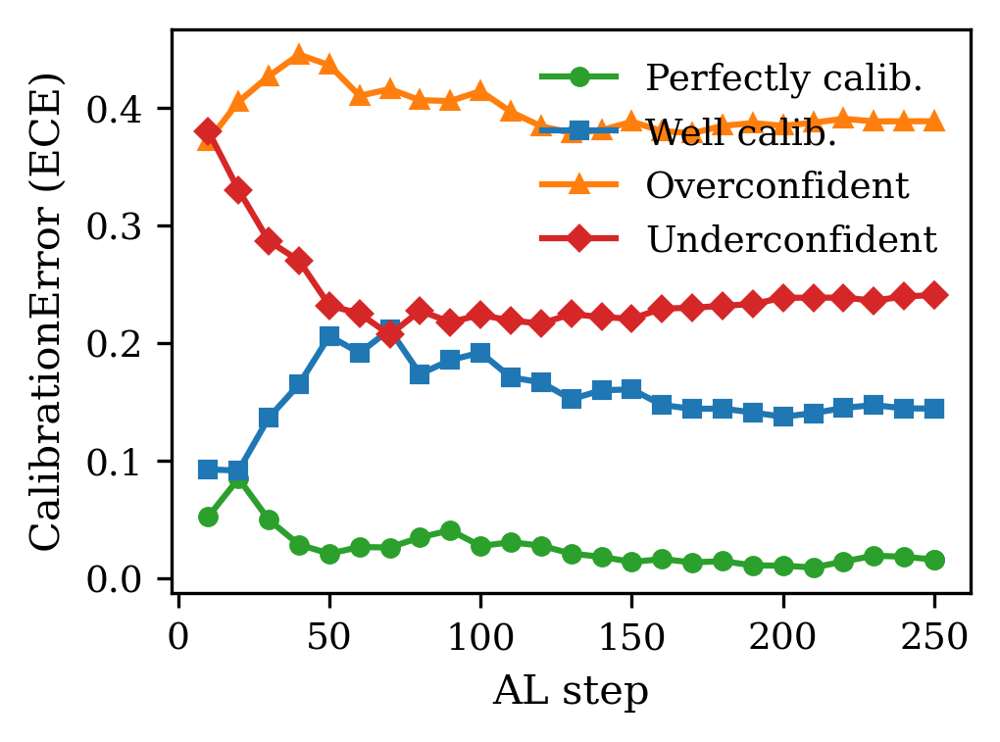

.. _demo-calibration:

Calibration scenarios demo (``ta-demo``)
=========================================

This demo compares four active learning runs side-by-side for a function minimization
task using active learning. This demonstrates how the
audit checks behave across the full calibration spectrum: ideal calibration, a
well-calibrated baseline, an overconfident system and an underconfident system.

.. code-block:: bash

   ta-demo                                          # all four scenarios, 100 steps (default)
   ta-demo --steps 250 --seed 0                     # used to generate the figures on this page

Introduction
------------

Calibration is the alignment between a model's reported uncertainty
and its empirical error rate. Overconfident models produce narrow uncertainty intervals that 
miss observations; underconfident models report wide uncertainty estimates with
little decision-relevant information.

**Questions:** (1) Can the eleven audit checks reliably distinguish a
well-calibrated ensemble from overconfident and underconfident variants of the
same surrogate on identical data?  (2) What does the ideal calibration
trajectory look like when the surrogate is paired with a correctly-specified
noise model and a simple oracle that allows convergence?

Uncertainty hook placement
~~~~~~~~~~~~~~~~~~~~~~~~~~

``hook.on_step()`` is called **after** each oracle evaluation and dataset
update, and **before** the surrogate is re-fit, so every check receives the
surrogate's pre-update prediction at the LCB-selected point:

.. code-block:: text

   Surrogate fit  →  LCB acquisition  →  Oracle query  →  add observation  ← hook.on_step()
        ↑                                                        |
        └────────────────────────────────────────────────────────┘

.. list-table:: Check-to-pipeline-step mapping
   :header-rows: 1
   :widths: 30 25 45

   * - Check
     - AL step monitored
     - What is observed
   * - ``CalibrationError``
     - Oracle query
     - Whether the bootstrap posterior at the acquired point correctly brackets the oracle outcome, accumulated over all steps
   * - ``ConformalCoverage``
     - Oracle query
     - Distribution-free marginal coverage validity
   * - ``CRPS``
     - Oracle query
     - Continuous Ranked Probability Score as a proper scoring rule
   * - ``NegativeLogLikelihood``
     - Oracle query
     - Gaussian NLL as a proper scoring rule
   * - ``PITUniformity``
     - Oracle query
     - KS test for PIT uniformity across all queried points
   * - ``IntervalScore``
     - Oracle query
     - Winkler interval score penalising non-coverage and excessive width
   * - ``IntervalCoverage``
     - Oracle query
     - Whether the 1σ bootstrap interval contains the oracle value ~68 % of the time
   * - ``VarianceAlignment``
     - Oracle query
     - Whether bootstrap ensemble spread explains prediction error globally
   * - ``UncertaintyEvolution``
     - LCB acquisition
     - Count of channels with a declining uncertainty trend (0 = all stable)
   * - ``UncertaintyAnomalies``
     - LCB acquisition
     - Fraction of current uncertainty values anomalously far from a historical baseline; skipped when no baseline is provided
   * - ``VarianceErrorCorrelation``
     - Oracle query
     - Whether the surrogate assigns larger σ to points where it errs most

Methods
-------

Benchmark functions
~~~~~~~~~~~~~~~~~~~

The ``perfectly_calibrated`` scenario uses an oracle with homoscedastic
noise that the bootstrap ensemble can match, allowing calibration to be
achieved in practice:

.. math::

   f_\text{cal}(x) = \sin(2\pi x), \quad \sigma = 0.3 \text{ (constant)}

The function has a single smooth minimum at :math:`x = 0.75` with amplitude 1.
A degree-5 polynomial bootstrap fits it well after 15-20 observations, at which
point the epistemic spread shrinks and the aleatoric floor dominates.

The three remaining scenarios use the Forrester *et al.* (2008) [Forrester2008]_
function with heteroscedastic noise:

.. math::

   f_\text{Forrester}(x) & = (6x - 2)^2 \sin(12x - 4), \quad x \in [0, 1]

   \sigma(x) & = 0.1 + 0.4\,x^2

The non-constant noise level means that a homoscedastic surrogate will
inevitably appear miscalibrated at both ends of the domain — a deliberate
design choice that amplifies calibration differences between scenarios.

Surrogate model
~~~~~~~~~~~~~~~

A **bootstrap-ensemble polynomial surrogate** [Efron1979]_ is used for these examples:

* Each ensemble member fits a degree-5 polynomial with Ridge regularisation; the dataset grows
  from 8 warm-start points to over 250 by the end of a full run.
  A full 100-step loop (default) with four scenarios completes in under ten seconds.

* Per-step predictive mean and std are estimated from the ensemble mean and
  standard deviation across members.
  
* Lower-confidence-bound (LCB) acquisition [Srinivas2010]_ with :math:`\kappa = 2.0` selects
  the next query point.

* The ensemble is seeded via ``numpy.random.default_rng``.

Four scenario configurations are run sequentially:

.. list-table::
   :header-rows: 1
   :widths: 28 30 42

   * - Scenario tag
     - Configuration
     - Expected behaviour
   * - ``perfectly_calibrated``
     - 30 estimators, std scale 0.7, aleatoric floor 0.3, sin oracle
     - Calibration transition: 5/6 PASS at step 10, 5–6/6 PASS from step 20 onward
   * - ``well_calibrated``
     - 30 estimators, std scale 0.7, aleatoric floor :math:`0.1 + 0.4x^2`, Forrester oracle
     - ``CalibrationError`` passes at step 10 (0.145) then fails as the accumulated LCB history inflates ECE above 0.15; ``IntervalCoverage`` fails throughout; the aleatoric floor is correctly matched to the oracle noise
   * - ``overconfident``
     - 5 estimators, std scale 0.3, aleatoric floor 0.1, Forrester oracle
     - CalibrationError and IntervalCoverage fail persistently (floor prevents epistemic collapse, std compression keeps intervals narrow)
   * - ``underconfident``
     - 30 estimators, std scale 4.0, aleatoric floor 1.0, Forrester oracle
     - VarianceAlignment and IntervalCoverage fail persistently (floor prevents epistemic collapse)

Bootstrap coverage underestimates epistemic uncertainty near the boundary but produces
realistic relative trends that the audit can evaluate.

Calibration control mechanisms
~~~~~~~~~~~~~~~~~~~~~~~~~~~~~~~

The ``BootstrapSurrogate`` exposes three parameters that together determine
whether predicted uncertainty matches oracle noise:

``n_estimators``
    Bootstrap ensemble size.  Fewer members undersample the space of polynomial
    fits, giving a narrow spread across members and therefore a small
    :math:`\sigma_\text{ep}`.  Five members produce very small epistemic spread;
    30 are needed for a realistic estimate.

``std_scale``
    A global scalar multiplied onto :math:`\sigma_\text{ep}` before combining
    with the aleatoric floor.  Values below 1 compress predicted uncertainty
    toward overconfidence; values above 1 inflate it toward underconfidence.

``aleatoric_fn(x)``
    A position-dependent noise floor :math:`\sigma_\text{al}(x)` added in
    quadrature with the scaled epistemic term:

    .. math::

       \sigma_\text{total}(x) =
           \sqrt{\bigl(\textit{std\_scale} \cdot \sigma_\text{ep}(x)\bigr)^2
                 + \sigma_\text{al}(x)^2}

    Once the surrogate converges and :math:`\sigma_\text{ep} \to 0`, only the
    floor survives.  Matching :math:`\sigma_\text{al}(x)` to the oracle noise
    function :math:`\sigma_\text{oracle}(x)` is therefore the key design
    decision for well-calibrated scenarios.

The four scenarios were each engineered by a deliberate combination of these
knobs:

**perfectly_calibrated** — The oracle noise is homoscedastic
(:math:`\sigma_\text{oracle} = 0.3`).  Setting the aleatoric floor to the
same constant (:math:`\sigma_\text{al} = 0.3`) guarantees
:math:`\sigma_\text{total} \to \sigma_\text{oracle}` once the surrogate fills
in the domain and :math:`\sigma_\text{ep} \to 0`.  The ``std_scale = 0.7``
compresses epistemic spread in early steps so that the surrogate is not
overconfident before the floor begins to dominate; it has no effect on the
converged value because the floor term is then the only contributor.

**well_calibrated** — The oracle noise is heteroscedastic
(:math:`\sigma_\text{oracle}(x) = 0.1 + 0.4x^2`).  The aleatoric floor is
set to match it exactly (:math:`\sigma_\text{al}(x) = 0.1 + 0.4x^2`), so
the floor is correctly specified.  However, LCB concentrates queries at
:math:`x \approx 0.76` where :math:`\sigma_\text{oracle} \approx 0.33`.
Early in the run :math:`\sigma_\text{ep}` is large at this point, inflating
:math:`\sigma_\text{total}` above the floor and producing underconfident
per-step measurements that accumulate in the running ECE — causing it to
exceed 0.15 even though the floor is correctly matched.

**overconfident** — Two knobs compress uncertainty in the same direction.
``n_estimators = 5`` undersamples the polynomial space, giving a small
:math:`\sigma_\text{ep}`.  ``std_scale = 0.3`` then compresses it by a
further 3×.  The result is :math:`\sigma_\text{total} \approx \sqrt{(0.3
\,\sigma_\text{ep})^2 + 0.01} \approx 0.1` throughout.  Since oracle noise
at :math:`x \approx 0.76` is :math:`\sigma_\text{oracle} \approx 0.33`, the
predicted intervals are systematically ~3× too narrow regardless of how many
observations are collected.

**underconfident** — Two knobs inflate uncertainty in the same direction.
``std_scale = 4.0`` amplifies :math:`\sigma_\text{ep}` by 4×, and the
constant floor :math:`\sigma_\text{al} = 1.0` sets a hard lower bound on
:math:`\sigma_\text{total}` that is already 3× larger than oracle noise at
:math:`x \approx 0.76`.  Even as the surrogate converges and
:math:`\sigma_\text{ep}` shrinks, the floor keeps :math:`\sigma_\text{total}
\geq 1.0` throughout the run, guaranteeing persistent underconfidence.

Results
-------

The results below are from a 250-step run with ``--seed 0``. 

Prediction results
~~~~~~~~~~~~~~~~~~

The perfectly calibrated surrogate model finds the minimum of the function
and has aleatoric uncertainty that cannot be reduced without overfitting.

The well calibrated surrogate model finds the minimum of the function
and has uncertainty that is smaller than the oracle.

The underconfident surrogate model has uncertainty that is larger than the error.

The overconfident surrogate model has uncertainty that is smaller than the error.

Check-grid heatmap
~~~~~~~~~~~~~~~~~~

Rows are pipeline stages — intermediate
audit reports produced every 10 steps plus the final report; columns are
the eleven checks.  Green cells indicate PASS; red cells indicate FAIL.  The
colour intensity is proportional to the magnitude of the check value
relative to the threshold, so mild failures appear light red and severe
failures appear deep red.

**Perfectly-calibrated scenario**

   Check-grid for the ``perfectly_calibrated`` scenario.
   Oracle: :math:`\sin(2\pi x) + \mathcal{N}(0,\, 0.3^2)`.
   Surrogate: 30-estimator bootstrap, std_scale=0.7, aleatoric floor
   :math:`\sigma_\text{al} = 0.3` added in quadrature.
   The total predicted uncertainty is
   :math:`\sigma_\text{total} = \sqrt{(0.7\,\sigma_\text{ep})^2 + 0.09}`.

This check-grid shows the calibration transition from uncalibrated to calibrated. 
At step 10, ``UncEvolution`` is the only failure (-0.142 per
step): LCB rapidly depletes the bootstrap's epistemic spread early in the
run as it focuses on the minimum of :math:`\sin(2\pi x)`.  All other checks
already PASS — ``CalibError = 0.104``, ``IntCoverage = 0.600`` (within the
53-83 % tolerance), ``VarAlignment = 0.901`` (predicted variance ≈ empirical
variance), ``VarErrCorr = 0.188`` (moderate Spearman correlation).

* ``UncEvolution`` recovers to -0.045 (within the -0.05 threshold) by step 20
    once the epistemic component stabilises at the 0.3 aleatoric floor.

* ``VarAlignment`` moves through 0.988 → 1.094 →
    1.253 as the surrogate converges: the predicted variance is now equal to or
    slightly above the empirical squared error because LCB queries near the
    well-explored minimum carry near-zero epistemic std.

* ``VarErrCorr`` rises from 0.188 (step 10) to 0.465 (step 20), reflecting
    that the surrogate correctly assigns higher total uncertainty to the few
    remaining unexplored pool regions.  ``VarianceErrorCorrelation`` remains
    positive through step 90, then falls below the 0.1 threshold as the
    well-explored surrogate has near-zero epistemic variance everywhere —
    the same behaviour flagged in the final audit report below.

**Well-calibrated scenario**

* ``CalibError`` passes at step 10 (0.145) then rises above the 0.15 threshold
    to 0.231 by step 100 and 0.220 at the final report.  The hook accumulates single-point (x_q, y_q, σ_q)
    observations from the LCB history; in early steps σ_ep at x≈0.76 is large
    (surrogate fit on few points), inflating sigma well above the 0.331 oracle
    noise and producing underconfident measurements that persist in the running
    average.

* ``IntCoverage`` fails throughout (0.400 at step 10, settling to 0.348 at the
    final report) — the 1-σ band covers only ~35% of oracle draws rather than the
    expected 68.3%, consistent with the explanation above.

* ``VarAlignment`` starts at 1.254 (step 10) and drifts to 1.431 at the final
    report, just below the 1.5 upper tolerance — a PASS throughout, confirming that
    the oracle-matched floor keeps global variance close to empirical squared error.

* ``UncEvolution`` flags channels with a declining uncertainty trend (non-zero
    count) at step 10 and step 20 as LCB depletes high-uncertainty pool regions,
    then passes (count = 0) from step 60 onward.

* ``UncAnomalies`` and ``VarErrCorr`` pass throughout.

**Overconfident scenario**

* ``CalibError`` is 0.390 at step 10 and remains 0.38–0.39 throughout the
    250-step run — systematic interval compression from std_scale=0.3 and
    aleatoric floor=0.1 keeps sigma near 0.1 while the oracle noise at x≈0.76
    is 0.33.

* ``IntCoverage`` opens at 0.100 (step 10) — barely 10% of oracle values fall
    inside the narrow 1-σ band — rising modestly to 0.168 at the final report as
    the mean prediction tightens.

* ``VarAlignment`` is 0.113–0.115 throughout: mean predicted variance is
    roughly 9× smaller than mean squared error, the defining signature of
    systematic overconfidence.

* ``VarErrCorr`` ranges from 0.588 at step 10 to 0.407 at the final report —
    the rank correlation between σ and \|error\| remains positive because the small
    committee still assigns relatively higher uncertainty to regions with larger
    residuals, even though the overall scale is wrong.

**Underconfident scenario**

Every metric is inverted relative to the overconfident case.

* ``IntCoverage`` spikes to 1.000 at step 10 — every observation falls inside
    the inflated 1-σ band — and remains near 0.940–0.970 through step 250 and the
    final report, consistently above the 83.3% upper tolerance.

* ``VarAlignment`` reaches 38.9 at step 10 (predicted variance ~39× the squared
    error), stabilising near 28–31 from step 100 onward — one to two orders of
    magnitude above the acceptable range.

* ``CalibError`` declines from 0.350 at step 10 toward 0.183 at step 100, then
    rises back to 0.238 at the final report.  The floor=1.0 keeps sigma >> oracle
    noise (0.33) throughout, so the ECE never collapses to near zero — persistent
    miscalibration rather than recovery.

* ``VarErrCorr`` is negative at steps 10–20 (−0.297, −0.301) since the uniform
    inflation decorrelates σ from actual error, but recovers to ~0.5 by step 100
    once the surrogate has enough data to assign relatively larger uncertainty to
    genuinely harder regions.

Calibration curves (reliability diagrams)
~~~~~~~~~~~~~~~~~~~~~~~~~~~~~~~~~~~~~~~~~

Each panel is a reliability diagram for one scenario.  The x-axis is the
expected nominal coverage level; the y-axis is the fraction of observations
actually covered at that level.  The dashed diagonal is perfect calibration;
the coloured solid curve is the observed reliability; the shaded region
represents the integral miscalibration (the ECE, [Kuleshov2018]_).

Calibration is evaluated here on fresh oracle draws at the training locations
(the LCB-acquired points), which avoids the large prediction bias that arises
when evaluating on a uniform grid in unexplored regions.

* **Perfectly calibrated (top-left, CE=0.022):** The curve tracks the diagonal
  closely across all confidence levels — the oracle-matched aleatoric floor and
  correct std_scale keep sigma aligned with oracle noise at the explored minimum.

* **Well calibrated (top-right, CE=0.128):** The curve lies slightly below the
  diagonal: the oracle-matched floor (0.1 + 0.4x²) is correctly sized at x≈0.76,
  but finite-sample noise in the bootstrap mean causes the effective error std to
  slightly exceed the floor value, giving mild apparent overconfidence.  CE < 0.15
  — this scenario passes the calibration check on the held-out test set.

* **Overconfident (bottom-left, CE=0.361):** The curve falls sharply below the
  diagonal — std_scale=0.3 and floor=0.1 compress sigma to ~0.1 while oracle
  noise is 0.33, so nominal intervals miss far more observations than expected.

* **Underconfident (bottom-right, CE=0.250):** The curve lies above the diagonal
  for all moderate-to-high confidence levels — the floor=1.0 inflates sigma far
  above the 0.33 oracle noise, so even low nominal intervals cover most
  observations.  CE=0.250 correctly flags this as a FAIL.

Cross-scenario Pareto frontier: CalibrationError (ECE) vs Mean Absolute Error (MAE)
~~~~~~~~~~~~~~~~~~~~~~~~~~~~~~~~~~~~~~~~~~~~~~~~~~~~~~~~~~~~~~~~~~~~~~~~~~~~~~~~~~~
The Pareto frontier visualization plots all scenario-stage combinations
(step 10, 20, …, 250, and final) on the ECE–MAE plane.  Each scenario
traces a trajectory from earlier stages (lighter markers, top-right) to
later stages (darker markers, lower-left).  The lower-left corner is
optimal: low ECE means well-calibrated uncertainty; low MAE means accurate
predictions.

* **Perfectly-calibrated (green circles):** Occupies the lower-left corner
   throughout.  Both ECE and MAE decrease as the surrogate fits the smooth
   sin oracle, confirming that a correctly-specified noise model allows
   simultaneous improvement in both calibration and accuracy.

* **Well-calibrated (blue squares):** Starts near (ECE 0.145, MAE 1.6)
   at step 10 and moves left as MAE improves, reaching ECE≈0.22, MAE≈0.65
   at the final stage.  ECE stays above 0.15 throughout because the hook
   measures the full LCB history including early high-σ steps.

* **Overconfident (orange triangles):** ECE stays in the 0.37–0.44 range
   at all stages (systematic interval compression from std_scale=0.3) while
   MAE is broadly comparable to the well-calibrated case.  No stage is
   non-dominated: another scenario always matches or beats this one on both
   axes simultaneously.  This is the defining signature of a pathological
   miscalibration — wasted query budget without commensurate accuracy gain.

* **Underconfident (red diamonds):** Early stages have ECE≈0.35 and high
   MAE (~2.8 at step 10), converging to ECE≈0.24, MAE≈0.70 at the final
   stage.  The aleatoric floor (1.0) prevents ECE from collapsing to near
   zero, so the red trajectory stays in the ECE≈0.18–0.35 band and never
   reaches the lower-left region occupied by the perfectly-calibrated
   scenario.

Calibration convergence per scenario
~~~~~~~~~~~~~~~~~~~~~~~~~~~~~~~~~~~~
CalibrationError (ECE) at each intermediate pipeline evaluation (steps 10,
20, …, 250, and final) for all four scenarios.

The ``perfectly_calibrated`` scenario (green) decreases from ≈ 0.10 (step 10)
to ≈ 0.017 (step 250), confirming that the audit correctly tracks the convergence
of a well-specified surrogate.  The ``well_calibrated`` (blue) scenario starts at
0.145 and rises to 0.22–0.25 as the hook accumulates a growing history of
single-point observations — early steps with large σ_ep inflate the ECE, which
settles near 0.22 once LCB fully concentrates at x≈0.76.  The overconfident
(orange) scenario starts at 0.39, peaks near 0.44 around step 20, then gradually
decreases to 0.38 — the aleatoric floor (0.1) prevents the false recovery that
would otherwise occur without a floor.  The underconfident (red) scenario starts
at 0.35, dips toward 0.18 around step 80–100, then rises back to 0.24 at step
250 — the floor=1.0 keeps sigma >> oracle noise (0.33) throughout, so the ECE
never collapses to near zero.

This figure complements the Pareto frontier above: the frontier shows *which*
combinations of ECE and MAE are achievable; the convergence plot shows *how
quickly* each scenario reaches them.

Discussion
----------

``hook.on_end()`` returns an :class:`~traits_audit.base.AuditReport` for each scenario. The per-scenario reports below show the final check values at 250 steps:

The ``perfectly_calibrated`` scenario passes ten of eleven checks at 250 steps;
``VarianceErrorCorrelation`` fails because the well-explored surrogate has near-zero
epistemic variance everywhere, weakening the rank correlation with absolute error:

.. code-block:: text

   ── Audit report ───────────────────────────────────────────────
   CalibrationError         PASS  value=0.017  threshold=0.150
   IntervalCoverage         PASS  value=0.720  threshold=[0.533, 0.833]
   VarianceAlignment        PASS  value=1.024  threshold=1.000
   UncertaintyEvolution     PASS  value=0     threshold=0.0
   UncertaintyAnomalies     PASS  value=0.008  threshold=0.050
   VarianceErrorCorrelation FAIL  value=-0.077 threshold=0.100
   ── Overall: FAIL ──────────────────────────────────────────────

The well-calibrated Forrester scenario shows two FAIL checks; ``CalibrationError``
and ``IntervalCoverage`` fail because the hook accumulates the full LCB history —
early steps have large σ_ep at x≈0.76 which inflates sigma above the oracle noise,
producing underconfident per-step measurements that persist in the averaged ECE
(final ``IntCoverage = 0.348``, ``VarAlignment = 1.431``):

.. code-block:: text

   ── Audit report ───────────────────────────────────────────────
   CalibrationError         FAIL  value=0.220  threshold=0.150
   IntervalCoverage         FAIL  value=0.348  threshold=[0.533, 0.833]
   VarianceAlignment        PASS  value=1.431  threshold=1.000
   UncertaintyEvolution     PASS  value=0     threshold=0.0
   UncertaintyAnomalies     PASS  value=0.028  threshold=0.050
   VarianceErrorCorrelation PASS  value=0.291  threshold=0.100
   ── Overall: FAIL ──────────────────────────────────────────────

For the overconfident scenario, ``IntervalCoverage`` is 0.168 and ``CalibrationError``
is 0.380 — systematic interval compression from std_scale=0.3 keeps sigma near 0.1
while oracle noise at x≈0.76 is 0.33.  For the underconfident scenario,
``VarianceAlignment`` is 28.0 and ``IntervalCoverage`` is 0.968 — the floor=1.0
inflates sigma far above the oracle noise throughout all 250 steps.

.. list-table:: Check interpretation guide
   :header-rows: 1
   :widths: 30 20 50

   * - Check
     - Threshold
     - What a FAIL means in this context
   * - CalibrationError
     - ≤ 0.15
     - Ensemble spread is systematically mismatched to empirical residuals [Kuleshov2018]_
   * - IntervalCoverage
     - 53 - 83 %
     - 1-σ intervals contain too few (overconfident) or too many (underconfident) points
   * - VarianceAlignment
     - 0.5 - 1.5
     - Mean predicted variance is not commensurate with mean squared error
   * - UncertaintyEvolution
     - 0 channels declining (threshold = 0.0)
     - Uncertainty is collapsing faster than data collection justifies
   * - UncertaintyAnomalies
     - ≤ 5 % steps with \|z\| > 3
     - Sporadic uncertainty spikes indicating a numerically unstable step
   * - VarianceErrorCorrelation
     - Spearman ρ ≥ 0.1
     - Predicted uncertainty is unrelated to where the model actually errs

References
----------

.. [Forrester2008] Forrester, A. I. J., Sóbester, A., & Keane, A. J. (2008).
   *Engineering Design via Surrogate Modelling: A Practical Guide.*
   Wiley. 

.. [Kuleshov2018] Kuleshov, V., Fenner, N., & Ermon, S. (2018).
   Accurate uncertainties for deep learning using calibrated regression.
   *Proceedings of the 35th International Conference on Machine Learning
   (ICML 2018)*, Proceedings of Machine Learning Research, 80, 2796-2804.

.. [Srinivas2010] Srinivas, N., Krause, A., Kakade, S. M., & Seeger, M. (2010).
   Gaussian process optimization in the bandit setting: No regret and
   experimental design.
   *Proceedings of the 27th International Conference on Machine Learning
   (ICML 2010)*, 1015-1022.

.. [Efron1979] Efron, B. (1979). Bootstrap methods: Another look at the
   jackknife. *The Annals of Statistics*, 7(1), 1-26.
