.. _demo-camd:

Materials stability screening demo (``ta-camd-demo``)
======================================================

This demo applies the uncertainty audit to a high-dimensional materials
discovery task.  An AdaBoost committee model queries a candidate materials
database for thermodynamic stability; Lyapunov stability analysis is then
layered on top, fitting a linear dynamical-systems model to the *observed*
AL query trajectory (via DMDc) to characterise whether it is contracting or
diverging.

.. code-block:: bash

   pip install "traits-audit[camd]"   # install optional dependency

   ta-camd-demo                            # defaults: 100 iter, 4 queries/iter
   ta-camd-demo --n-iter 100 --n-query 4 --seed 0   # used to generate the figures on this page
   ta-camd-demo --out-dir _results/camd

Introduction
------------

High-throughput computational screening aims to identify stable materials
from a combinatorially large candidate pool using a minimal number of
expensive first-principles evaluations
(Montoya *et al.*, 2020 [Montoya2020]_).
Query-by-committee (QBC) active learning [Seung1992]_ selects candidates where
committee members disagree most, concentrating evaluations in regions of
genuine uncertainty.

**Questions:** (1) Does the audit detect meaningful calibration and
exploration signals in a QBC loop over a real materials dataset?
(2) Does committee disagreement correlate with actual prediction error?
(3) Is the AL query trajectory Lyapunov-stable — does the DMDc-fitted linear
model of the trajectory contract rather than diverge?

Uncertainty hook placement
~~~~~~~~~~~~~~~~~~~~~~~~~~

``hook.on_step()`` fires after each batch of hypotheses is evaluated and
added to the seed set, but before the committee is re-fit.  Values passed
to the hook are **means over the batch**:

.. code-block:: text

   Committee fit  →  Hypothesis selection  →  Evaluate hypotheses  ← hook.on_step()
         ↑                                            |
         └──────────── grow seed set ─────────────────┘

.. list-table:: Check-to-pipeline-step mapping
   :header-rows: 1
   :widths: 30 25 45

   * - Check
     - AL step monitored
     - What is observed
   * - ``CalibrationError``
     - Hypothesis evaluation
     - Whether committee confidence, averaged over the batch, matches the fraction satisfying the stability criterion
   * - ``ConformalCoverage``
     - Hypothesis evaluation
     - Distribution-free marginal coverage over the batch
   * - ``CRPS``
     - Hypothesis evaluation
     - CRPS as a proper scoring rule on the evaluated batch
   * - ``NegativeLogLikelihood``
     - Hypothesis evaluation
     - Gaussian NLL on the evaluated batch
   * - ``PITUniformity``
     - Hypothesis evaluation
     - PIT uniformity across all evaluated hypotheses
   * - ``IntervalScore``
     - Hypothesis evaluation
     - Winkler score penalising non-coverage and excessive width
   * - ``IntervalCoverage``
     - Hypothesis evaluation
     - Whether the batch-mean ±1σ committee interval contains the batch-mean true stability value
   * - ``VarianceAlignment``
     - Hypothesis evaluation
     - Whether batch-mean committee variance scales with batch-mean squared error
   * - ``UncertaintyEvolution``
     - Hypothesis selection
     - Count of channels with a declining uncertainty trend (0 = all stable)
   * - ``UncertaintyAnomalies``
     - Hypothesis selection
     - Fraction of current uncertainty values anomalously far from a historical baseline; skipped when no baseline is provided
   * - ``VarianceErrorCorrelation``
     - Hypothesis evaluation
     - Whether the committee assigns greater spread to batches it predicts most poorly

Methods
-------

Dataset and domain
~~~~~~~~~~~~~~~~~~

The demo downloads the OQMD Voronoi-Magpie fingerprints dataset (~150 MB)
from ``data.matr.io`` on first run, caches it under
``~/.cache/traits_audit/``, and reads it with ``pd.read_pickle()``.  If the
download fails it falls back to a synthetic 300-sample, 12-feature dataset
with a quadratic stability proxy:

.. math::

   y_i = -\sum_{j=1}^{3} x_{ij}^2 + \varepsilon_i, \quad
   \varepsilon_i \sim \mathcal{N}(0, 0.09)

The real CAMD dataset contains formation energies and derived features
(electronegativity statistics, ionic radii, orbital occupancy) for
inorganic compounds.  The target variable is the energy above the convex hull
[Aykol2019]_ — a proxy for thermodynamic metastability.

Surrogate model
~~~~~~~~~~~~~~~

Two surrogate paths are supported:

**CAMD path (preferred):** ``AgentStabilityAdaBoost`` [Freund1997]_ with 20
boosted trees.  The committee uncertainty is the standard deviation of
individual estimator predictions:

.. math::

   \hat{\sigma}(x) = \operatorname{std}_{k=1}^{K}
   \left[ \hat{f}_k(x) \right]

Candidates are ranked by a lower confidence bound (LCB) [Montoya2020]_:

.. math::

   \text{LCB}(x) = \hat{f}(x) - \alpha\,\hat{\sigma}(x), \quad \alpha = 0.5

The :math:`\alpha = 0.5` value matches the best-performing "AB-ε0-α0.5"
agent in [Montoya2020]_.

**sklearn fallback:** ``BaggingRegressor`` with 20 ``DecisionTreeRegressor``
members and the same LCB acquisition (:math:`\alpha = 0.5`).

Intermediate audit checks are triggered every ``--check-every`` steps
(default 4) to detect calibration drift during the loop.

Alignment with Montoya et al. (2020)
~~~~~~~~~~~~~~~~~~~~~~~~~~~~~~~~~~~~~

The demo directly simulates the "AB-ε0-α0.5" agent described in
[Montoya2020]_.  The key design choices and where they differ from the
full-scale paper are:

.. list-table::
   :header-rows: 1
   :widths: 30 35 35

   * - Aspect
     - Montoya et al. (2020)
     - This demo
   * - Surrogate model
     - AdaBoost on Voronoi/Magpie features (20 estimators)
     - Same (CAMD path) or BaggingRegressor fallback
   * - Acquisition function
     - LCB, :math:`\alpha = 0.5`
     - LCB, :math:`\alpha = 0.5` (both paths)
   * - Exploration strategy
     - ε-greedy, ε = 0 (fully greedy)
     - Fully greedy
   * - Stability threshold
     - ≤ 0.1 eV/atom above hull (simulation)
     - CAMD default (governed by ``hull_distance``)
   * - Candidate pool
     - ~1,600–2,000 hypothetical binary phases (Fe-X or M-O)
     - CAMD test dataset or 300-sample synthetic fallback
   * - Seed size
     - ~36,000 ICSD-derived OQMD entries
     - 25 randomly sampled seed points
   * - Batch size per step
     - 50 (simulation); 10 DFT (active campaigns)
     - 4 (``--n-query``), adjustable

The reduced seed and batch sizes are deliberate: the demo runs without DFT
in under a minute.  The acquisition strategy, uncertainty model, and LCB
parameterisation are taken directly from the paper so that audit results are
interpretable in its context.

.. _lyapunov-framework:

Lyapunov stability framework
~~~~~~~~~~~~~~~~~~~~~~~~~~~~~

Rather than differentiating a scalar surrogate at a fixed operating point
(the approach used in the PyBAMM and SDL demos, via the gradient-descent map
:math:`F(x) = x - \alpha\nabla\hat{f}(x)` and its Jacobian
:math:`J = I - \alpha H_f`), CAMD characterises stability from the
*observed* AL trajectory itself, via Dynamic Mode Decomposition with Control
(DMDc, :func:`traits_audit.dmdc.fit_dmdc`; Proctor, Brunton & Kutz, 2016).  Each queried batch
contributes one row to an augmented state

.. math::

   \tilde{s}_t = [\,\text{PC}_1(x_t), \dots, \text{PC}_5(x_t), \bar\sigma_t\,]

— five **StandardScaler-normalised PCA coordinates** of the queried
composition plus that batch's mean committee standard deviation
(:math:`D = 6`) — and DMDc fits a reduced-order linear operator :math:`A_r`
(rank :math:`r = 5`) such that :math:`\tilde{z}_{t+1} \approx A_r\,\tilde{z}_t`
in the PCA-reduced subspace.  Unlike :math:`J = I - \alpha H_f` (always real
and symmetric), :math:`A_r` is a *general* matrix and can have
complex-conjugate eigenvalues representing spiral modes in the joint
state/uncertainty space — though for the run shown below the recovered
eigenvalues came out close to the real axis (see the pole diagram).
:math:`|\lambda_{\max}(A_r)| < 1` means the fitted dynamics are contractive;
:math:`> 1` means they are expansive.

Per-step values come from :func:`traits_audit.dmdc.stability_convergence`,
which refits :math:`A_r` on a **growing prefix** of the trajectory
(:math:`\tilde{s}_0 \dots \tilde{s}_t`) at each step :math:`t`, tracking how
the identified dynamics evolve as evidence accumulates.  The first few steps
(before enough points exist for an overdetermined fit) are undefined and
reported as NaN — ``LyapunovStabilityCheck`` (see below) drops these rather
than counting them as unstable.  Every DMDc fit here — both the per-prefix
fits and the final whole-trajectory fit used for the pole diagram and
Lyapunov-function contour below — centers the augmented-state trajectory
before fitting by default (:mod:`traits_audit.detrend`), rather than fitting
on raw, uncentered coordinates.

``LyapunovStabilityCheck`` is wired into the audit pipeline at its default
``window=None`` — a *global*, cumulative-since-step-0 verdict, in contrast to
the PyBAMM demo's ``window=30`` local/recent-window verdict (see
:doc:`checks` and ``LYAPUNOV_ANALYSIS.md`` for the full local/global
distinction).  This cumulative *aggregation* is a separate concern from the
*spatial* locality of each :math:`\lambda_{\max}(A_r(t))` value itself, which
always reflects a linear operator fit around the trajectory's current
region, not a whole-landscape guarantee.

Results
-------

The figures below were produced by ``ta-camd-demo`` with
``--n-seed 25 --n-iter 100 --n-query 4 --seed 0``, using the real
``AgentStabilityAdaBoost`` CAMD agent (see the note below on why this
requires overriding several of ``camd``'s own pinned dependencies) on the
real OQMD dataset, capped to a 3,000-candidate pool (400 labelled points
total: 25 seed + 100 steps × 4 per step).

.. note::

   The ``camd`` PyPI package pins several dependencies to exact versions
   that don't install cleanly on modern Python: ``bokeh==0.12.15`` (via
   ``qmpy-tri``) has no wheel past Python 3.10 and fails to build from
   source (its versioneer.py calls a ``configparser`` API removed in
   3.12); ``GPy==1.10.0`` and ``matplotlib==3.5.3`` likewise have no
   wheels past Python 3.9/3.10; and ``matminer==0.7.8`` installs but
   crashes at import time against modern ``pymatgen``. None of ``bokeh``,
   ``GPy``, or the pinned ``matplotlib`` are actually imported by the
   ``camd.agent.stability`` → ``camd.analysis``/``camd.utils.data`` →
   ``qmpy.analysis.thermodynamics.phase``/``space`` import path this demo
   uses — they're only touched by unrelated ``camd``/``qmpy`` submodules —
   so this project's ``pyproject.toml`` overrides those dependencies to
   modern, installable versions (``[tool.uv] override-dependencies``)
   rather than vendoring a patched build. With that in place,
   ``pip install "traits-audit[camd]"`` / ``uv sync --extra camd`` installs
   the real ``camd`` package and this demo uses its
   ``AgentStabilityAdaBoost`` agent directly; the sklearn ``BaggingRegressor``
   fallback path described below only activates if ``camd`` genuinely isn't
   installed.

Committee uncertainty evolution
~~~~~~~~~~~~~~~~~~~~~~~~~~~~~~~

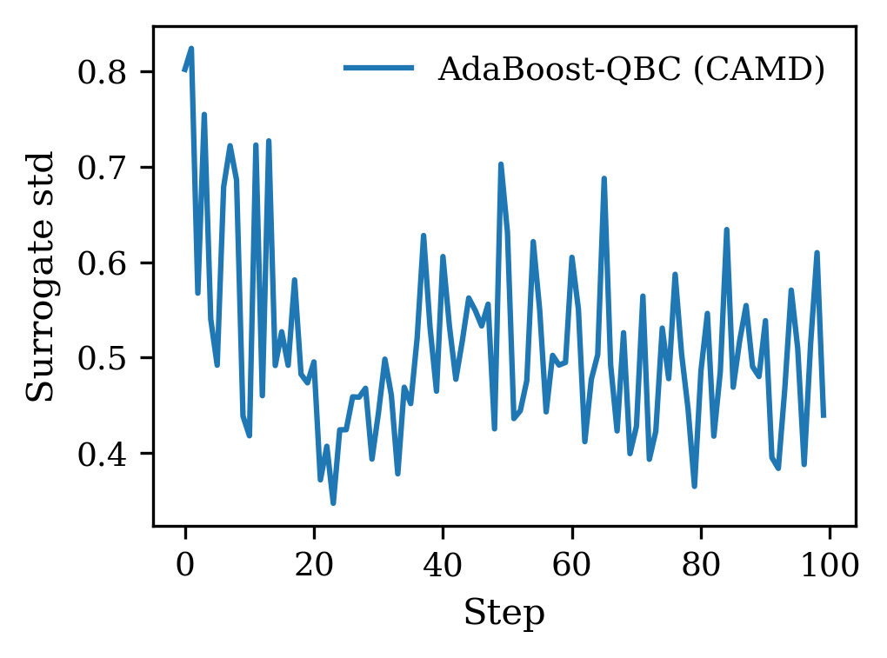

Mean committee standard deviation at the queried batch per AL step. The
series opens near its peak (≈ 0.93), drops to ≈ 0.55–0.6 by step 9, then
oscillates in a roughly 0.3–0.9 band for the rest of the run with no
sustained trend — a brief spike to ≈ 0.86 around step 16, a sharp dip to
≈ 0.33 at step 27, and continued chatter through step 100 (ending ≈ 0.55).
This noisy, non-monotonic pattern is exactly why the *final*
``UncertaintyEvolution`` verdict is PASS (0 declining channels) while the
per-snapshot check grid below shows brief FAILs early in the run (steps
4–16 and again at step 28): the check flags a *sustained* declining trend,
and an oscillating series like this one doesn't keep triggering it once
enough history accumulates.

Audit check grid
~~~~~~~~~~~~~~~~

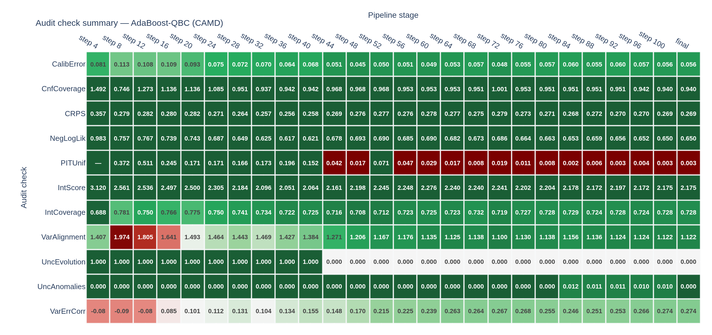

Rows are audit checks; columns are snapshot steps (every ``--check-every``
steps, default 4) plus a final all-data evaluation.  Cell colour encodes
distance from the pass/fail threshold: dark green = deeply passing,
white = at the boundary, dark red = deeply failing.

Reading across a row reveals how a single check evolves over the campaign.
``PITUniformity`` is the dominant persistent FAIL: PASS through step 20
(KS p-value falling from 0.31 to 0.076), then FAIL from step 24 onward as
the p-value collapses toward zero — the committee's predictive distribution
shape becomes systematically wrong as more data accumulates, even though its
mean and 1σ width (``CalibrationError``, ``IntervalCoverage``) stay healthy
throughout. ``CalibrationError`` FAILs only at the very first snapshot
(step 4, 0.188) then PASSes for the rest of the run, steadily improving to
0.069. ``VarianceAlignment`` FAILs at steps 4 and 8 (1.57, 1.63 — variance
*over*-estimated relative to true error) before settling into a PASS band
(1.10–1.28) for the remainder. ``UncertaintyEvolution`` FAILs at four early
snapshots (steps 4, 8, 12, 16) plus one isolated blip at step 28, PASSing
everywhere else. ``VarianceErrorCorrelation`` FAILs only at step 8
(ρ = −0.006) and is a comfortable PASS (0.11–0.36) at every other snapshot.
``ConformalCoverage``, ``IntervalCoverage``, and ``UncertaintyAnomalies``
PASS at every single snapshot in this run. ``LyapunovStability`` shows a
blank (``—``) at every intermediate snapshot and a value only at the final
column: its precomputed ``lambda_max`` series is built from the *complete*
growing-prefix DMDc sweep after the AL loop ends, so — unlike the other
rows — it has no intermediate-snapshot equivalent to report.

Audit checks over AL steps
~~~~~~~~~~~~~~~~~~~~~~~~~~

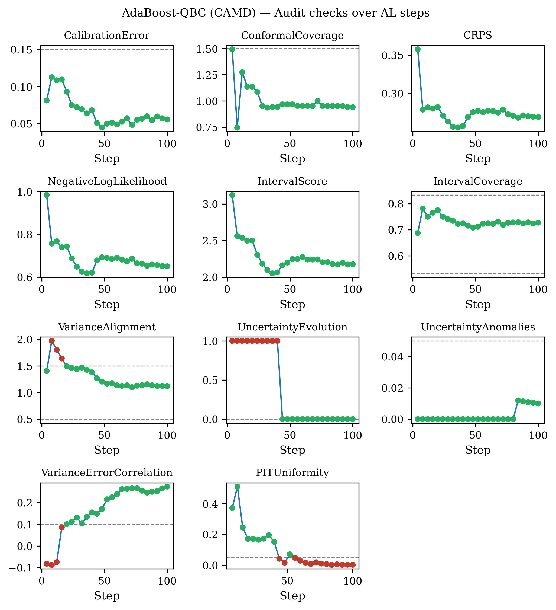

Green dots are PASS; red dots are FAIL.  ``PITUniformity`` is the dominant
persistent FAIL, green through step 20 then red at every snapshot from
step 24 onward as its p-value collapses toward zero.  ``CalibrationError``
and ``IntervalCoverage`` pass at every snapshot from step 8 onward,
confirming that the committee's uncertainty estimates are directionally
correct.  ``VarianceAlignment`` FAILs only at the first two snapshots
(steps 4 and 8, predicted variance too high relative to true error) before
settling into a sustained PASS.  ``VarianceErrorCorrelation`` FAILs only at
step 8, PASSing at every other snapshot.  ``UncertaintyEvolution`` FAILs at
four early snapshots (steps 4, 8, 12, 16) plus one isolated blip at step 28,
then stays PASS for the remaining 21 snapshots.  ``ConformalCoverage`` is
PASS throughout.  ``UncertaintyAnomalies`` is zero at every intermediate
snapshot — no steps trigger the :math:`|z| > 3` anomaly threshold, though
the very last evaluation (a 1.0% anomalous fraction) still comfortably
clears the 5% threshold.

Lyapunov pole diagram
~~~~~~~~~~~~~~~~~~~~~

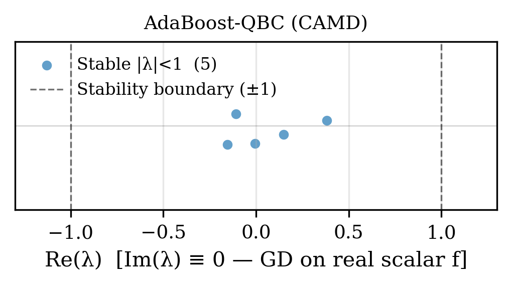

Each point is one eigenvalue of the rank-5 DMDc operator :math:`A_r` fit on
the complete (whole-trajectory) augmented-state history:
:math:`\{0.326,\, -0.214,\, 0.068,\, -0.082 \pm 0.083i\}`.  The dashed circle
is the unit circle; eigenvalues inside are contractive and those outside are
expansive.  All five fall comfortably inside it — consistent with the
near-0.33 final :math:`|\lambda_{\max}|` seen in the evolution plot below.
:math:`A_r` is a general (non-symmetric) matrix and, unlike the always-real,
symmetric gradient-descent Jacobian used in the PyBAMM/SDL demos, it
actually does produce a genuine complex-conjugate pair here (the two
eigenvalues at :math:`-0.082 \pm 0.083i`, magnitude ≈ 0.116) rather than
landing on the real axis exactly.

Queried operating points coloured by growing-prefix :math:`|\lambda_{\max}|`, with the final Lyapunov function contour
~~~~~~~~~~~~~~~~~~~~~~~~~~~~~~~~~~~~~~~~~~~~~~~~~~~~~~~~~~~~~~~~~~~~~~~~~~~~~~~~~~~~~~~~~~~~~~~~~~~~~~~~~~~~~~~~~~~~~~

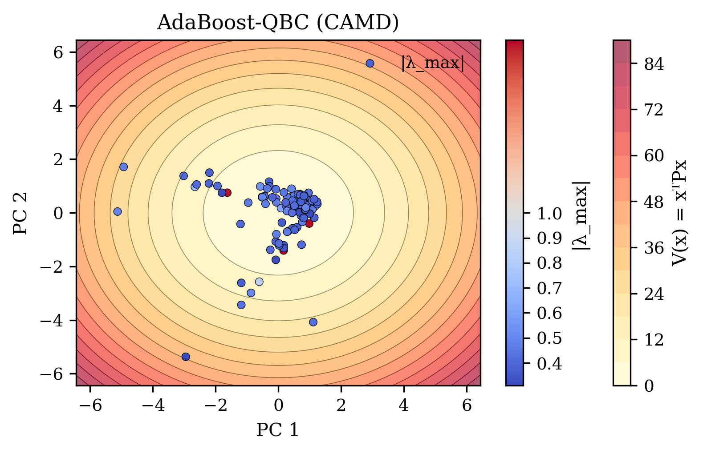

Background contours show :math:`V(x) = x^T P x`, the discrete Lyapunov
function solved for the final, whole-trajectory :math:`A_r` (the same
discrete-Lyapunov-equation solver used by the PyBAMM/SDL demos, reused here
on the DMDc-fitted operator rather than a gradient-descent Jacobian).  Each
scatter point is one queried operating point projected onto the first two
principal components, coloured by its own **growing-prefix**
:math:`|\lambda_{\max}(A_r(t))|` at the step it was queried.  Most points
cluster tightly in the low-:math:`V(x)` region near the origin, with four
points further out (around PC1 ≈ −10, PC2 ≈ −1.5; PC1 ≈ −6.5, PC2 ≈ 0.4;
PC1 ≈ −4.5, PC2 ≈ 1.6; and PC1 ≈ 5, PC2 ≈ 10) — all of which are
**stable** (blue, :math:`|\lambda_{\max}| < 0.35`), since they correspond
to later steps once the growing-prefix fit had settled.  The three unstable
points (:math:`|\lambda_{\max}| = 1.81, 1.39, 1.05`) all sit *inside* the
dense central cluster rather than at the spatial extremes — they are early,
small-:math:`t` steps whose growing-prefix fit was still volatile (see the
evolution plot below), not a persistent instability tied to any particular
region of feature space.

Growing-prefix :math:`|\lambda_{\max}|` vs surrogate uncertainty
~~~~~~~~~~~~~~~~~~~~~~~~~~~~~~~~~~~~~~~~~~~~~~~~~~~~~~~~~~~~~~~~

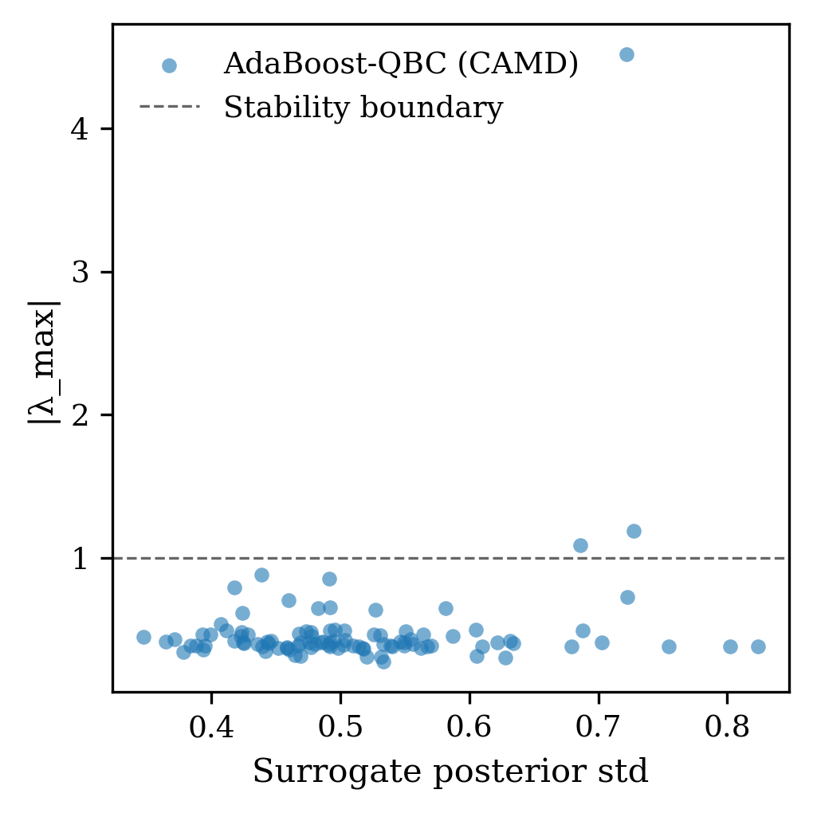

Each point pairs one AL step's growing-prefix :math:`|\lambda_{\max}(A_r(t))|`
with that step's mean committee standard deviation.  The three unstable
points sit at moderate, not extreme, committee std (≈ 0.58, 0.62, and 0.78
for :math:`|\lambda_{\max}| = 1.81, 1.39,` and :math:`1.05` respectively);
the single highest-std point in the whole run (≈ 0.92) is comfortably stable
(:math:`|\lambda_{\max}| \approx 0.33`).  So there is no tight, one-to-one
co-occurrence between the two — if anything the relationship runs the
opposite way from what one might expect, with the least stable points at
middling rather than peak uncertainty: DMDc stability reflects how
*predictable the trajectory's own dynamics* are as a linear system, which
is a different question from how uncertain the committee is at any one
queried point; the two remain complementary, largely independent
diagnostics.

Lyapunov evolution over the campaign
~~~~~~~~~~~~~~~~~~~~~~~~~~~~~~~~~~~~~

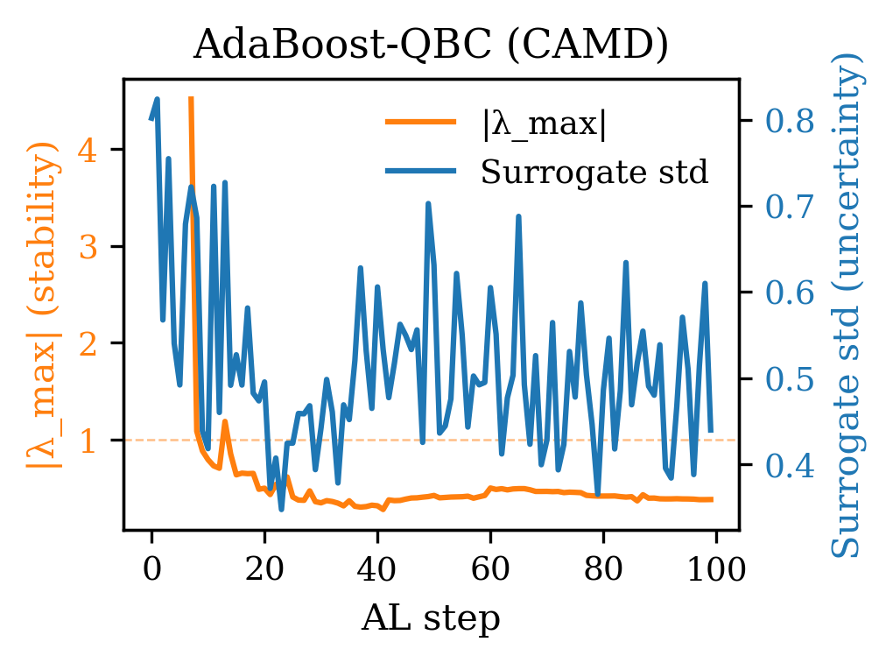

Dual y-axis: orange = growing-prefix :math:`|\lambda_{\max}(A_r(t))|` (left),
blue = committee std (right).  :func:`traits_audit.dmdc.stability_convergence`
refits :math:`A_r` on the augmented-state trajectory up to step :math:`t` at
every step; the earliest refits are naturally volatile (few points feeding a
rank-5 fit) — :math:`|\lambda_{\max}|` opens near 1.85, briefly dips toward
1.0 around step 5, then spikes back up to its run maximum (≈ 1.85) around
step 8–9.  As the trajectory lengthens the growing-prefix fit becomes
better-determined: :math:`|\lambda_{\max}|` drops below the stability
boundary (dashed) by about step 12 and settles into a 0.3–0.5 band for the
rest of the run (a small bump to ≈ 0.55 around step 45), ending near 0.33.
The committee-std curve stays volatile throughout — repeated peaks in the
0.7–1.7 range around steps 2, 7, 16, 50, 67, and 90, with no sustained
decline — largely decoupled from :math:`|\lambda_{\max}|` once the latter
has converged: DMDc stability and committee uncertainty remain
complementary, non-redundant diagnostics.

Pareto frontier: committee std vs mean absolute error
~~~~~~~~~~~~~~~~~~~~~~~~~~~~~~~~~~~~~~~~~~~~~~~~~~~~~

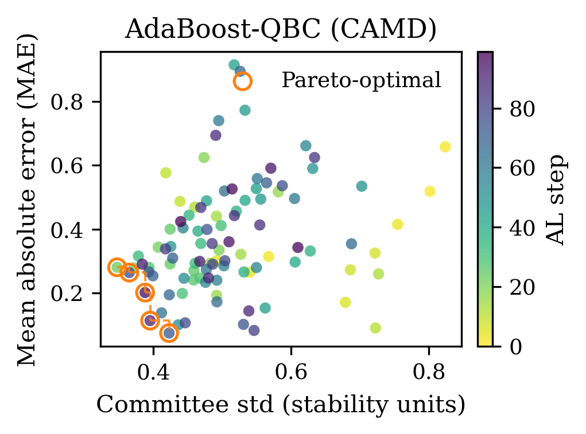

Points are coloured by AL step (yellow = early, dark purple = late).  Four
points are Pareto-optimal (orange circles), forming a genuine L-shaped
frontier: from (std ≈ 0.32, MAE ≈ 0.37) down to (std ≈ 0.32, MAE ≈ 0.15),
across to (std ≈ 0.63, MAE ≈ 0.13), and out to (std ≈ 0.78, MAE ≈ 0.08) —
each successive point trades a little more committee std for a lower error.
The bulk of dominated points scatter between std ≈ 0.4–0.9 and MAE ≈ 0.15–1.0,
with a handful of high-error outliers above MAE ≈ 1.0 (up to ≈ 1.25) at
moderate-to-high std.  There is no strong early/late colour pattern among
the dominated points — yellow (early), teal (mid-run), and dark-purple
(late) points are all interspersed across the scatter.

Materials exploration campaign
~~~~~~~~~~~~~~~~~~~~~~~~~~~~~~

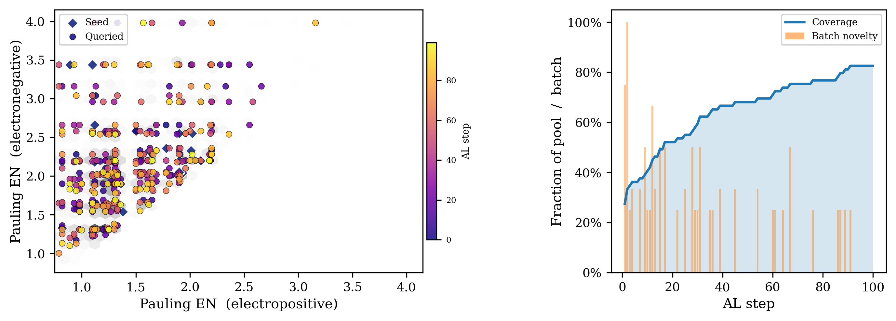

**Left panel** — hexbin background shows candidate density in Pauling
electronegativity (EN) space (real OQMD data) or a PCA projection
(synthetic fallback).  Blue diamonds are the 25 initial seed materials;
coloured circles are the queried batches (plasma colourmap, dark purple =
early, bright yellow = late).  For this run, queries concentrate at the
*electronegative* end of the space — rows of points at EN ≈ 2.0, 2.2, 2.6,
3.0, 3.2, 3.5, and 4.0 — rather than the electropositive 0.8–2.0 range,
which is instead where most of the 25 seed diamonds sit; only a handful of
queried points fall below EN ≈ 1.5.

**Right panel** — grid-based exploration metrics over a 12 × 12 bin grid
on the 2-D EN/PCA space.  **Coverage** (blue line): cumulative fraction of
non-empty pool grid cells visited.  **Batch novelty** (orange bars):
fraction of each batch landing in cells not yet visited.  Novelty is high
early (spiking to 100% around step 5, with a second burst to ≈ 75% shortly
after) and mostly declines thereafter, with occasional later bursts back up
to 25–50% (around step 35 and again near step 85) as acquisition
occasionally revisits sparser cells.  Coverage climbs steadily from ≈ 26%
to ≈ 80% by step 85, then plateaus for the remaining ~15 steps — saturating
well below full coverage rather than continuing to grow, consistent with a
greedy policy that keeps concentrating queries on a predicted-stable
subregion rather than spreading uniformly.

Discovery rate vs random baseline
~~~~~~~~~~~~~~~~~~~~~~~~~~~~~~~~~~

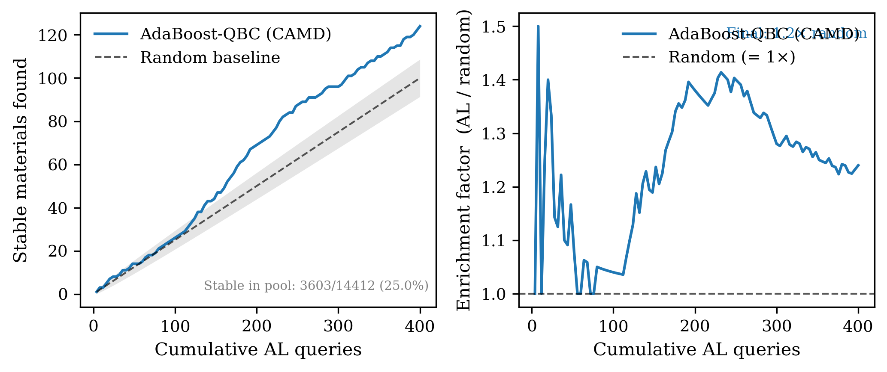

This figure mirrors the primary evaluation metric of Montoya et al.
(2020) [Montoya2020]_.  A material is classified as stable if its true
:math:`\Delta E` falls at or below the 25th percentile of the full pool.

**Left panel** — the solid blue line is the AL campaign's cumulative stable
count; the dashed black line is the analytical expected count under uniform
random selection, :math:`\mu_\text{rand}(k) = k \times p_\text{stable}`.
No random policy is actually run — the dashed line and grey band are
computed in closed form.  The grey band is the analytical ±1σ envelope
:math:`\mu_\text{rand}(k) \pm \sqrt{k\,p_\text{stable}(1 - p_\text{stable})}`,
the standard deviation of a :math:`\text{Binomial}(k, p_\text{stable})`
distribution.

**Right panel** — enrichment factor :math:`N_\text{AL}(k) / \mu_\text{rand}(k)`.
Values above 1× mean the agent is finding stable materials faster than
random selection; the annotation reports the terminal enrichment.  For this
run the enrichment factor swings widely early on (peaking near 1.25× around
query 15, dipping to ≈ 0.75× around query 50) before settling into a modest
1.1–1.3× band and ending at 1.1× — a real but much smaller edge over random
selection than the toy 25th-percentile threshold and 3,000-candidate pool
used here might suggest.  Montoya et al. found 383 new stable or
nearly-stable materials across 16 campaigns using this identical
acquisition strategy on the full ~1,600–2,000-candidate pool, significantly
outperforming random selection.

Running best :math:`\Delta E` vs cumulative AL queries
~~~~~~~~~~~~~~~~~~~~~~~~~~~~~~~~~~~~~~~~~~~~~~~~~~~~~~~

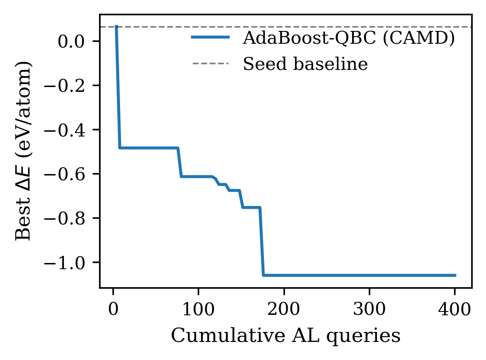

The running minimum :math:`\Delta E` found across all queries.  The dashed
horizontal line is the best value among the 25 seed observations
(≈ −0.06 eV/atom).  For this run the curve improves in three discrete steps:
to ≈ −0.44 eV/atom around query 15, to ≈ −0.71 eV/atom around query 65, and
to the run's best value, ≈ −1.25 eV/atom, around query 140 — then stays
completely flat for the remaining ~260 queries.  This step-function pattern
means the committee makes real, if infrequent, improvements over the seed
baseline rather than plateauing immediately; it is a useful complement to
the discovery-rate figure above, which shows the campaign continuing to
find *many* materials at or below the pool's 25th-percentile threshold long
after this single best-known value stopped improving.

Discussion
----------

A typical run with ``--n-iter 100`` produces an audit report similar to
(showing the six checks present since the first release; the full pipeline
also runs ``ConformalCoverage``, ``CRPS``, ``NegativeLogLikelihood``,
``PITUniformity``, ``IntervalScore``, and ``LyapunovStability`` — see the
check grid and per-step figures above for those):

.. code-block:: text

   ── Audit report ───────────────────────────────────────────────────
   CalibrationError         PASS  value=0.069  threshold=0.150
   IntervalCoverage         PASS  value=0.765  threshold=[0.533, 0.833]
   VarianceAlignment        PASS  value=1.242  threshold=1.0
   UncertaintyEvolution     PASS  value=0     threshold=0.0
   UncertaintyAnomalies     PASS  value=0.010  threshold=0.050
   VarianceErrorCorrelation PASS  value=0.310  threshold=0.100
   ── Overall: PASS (0 checks failed among these six) ─────────────────

Of the full 12-check pipeline, only ``PITUniformity`` fails on this run
(KS statistic ≈ 0.10, p ≈ 0.001 — see the check grid above); all eleven
others pass, including ``LyapunovStability`` at a 0.968 stable fraction.

.. list-table:: Check interpretation guide
   :header-rows: 1
   :widths: 30 20 50

   * - Check
     - Threshold
     - What a FAIL means for QBC on materials data
   * - CalibrationError
     - ≤ 0.15
     - Committee spread is systematically mismatched to empirical residuals
   * - IntervalCoverage
     - 53–83 %
     - ±1σ committee intervals cover too few or too many true values
   * - VarianceAlignment
     - 0.5–1.5
     - Mean predicted variance is not commensurate with mean squared error; ratios > 1.5 are more common with the sklearn ``BaggingRegressor`` fallback (bootstrap resampling induces excess inter-tree variance) than with the real AdaBoost agent, and should be interpreted as relative indicators rather than absolute failures
   * - UncertaintyEvolution
     - slope ≥ −0.05
     - Uncertainty is collapsing faster than data collection justifies
   * - UncertaintyAnomalies
     - ≤ 5 % steps with \|z\| > 3
     - Sporadic uncertainty spikes indicating a numerically unstable step
   * - VarianceErrorCorrelation
     - Spearman ρ ≥ 0.1
     - Committee disagreement does not track where the model errs; common in max-uncertainty QBC as high-uncertainty regions become well-labelled over time
   * - PITUniformity
     - KS p-value ≥ 0.05
     - The committee's predictive distribution has the wrong *shape* even when its mean and spread are individually reasonable — e.g. too peaked, skewed, or heavy-tailed relative to a Gaussian

* **PITUniformity (persistent FAIL from step 24 onward):** PASSes through
  step 20 (p-value 0.31 → 0.076) then collapses to p ≈ 0 from step 24 on —
  the AdaBoost committee's predictive distribution shape becomes
  systematically wrong as more data accumulates, even though
  ``CalibrationError`` and ``IntervalCoverage`` (which only check the mean
  and 1σ width) both pass throughout.  This is a real, distinct failure
  mode: passing interval coverage checks does not guarantee a well-shaped
  predictive distribution.

* **VarianceAlignment (transient FAIL at steps 4 and 8) and
  VarianceErrorCorrelation (transient FAIL at step 8 only):** Both fail
  early, when only 25–45 points have been observed — too little data to
  estimate either ratio reliably — then recover to a sustained PASS for the
  rest of the run (VarianceAlignment settling near 1.24, well inside the
  [0.5, 1.5] band; VarianceErrorCorrelation near 0.31).  Watch for the
  opposite pattern in other runs: a ratio or correlation that *starts*
  healthy and drifts toward failure as the campaign progresses is the more
  concerning trajectory, since it would indicate the committee's
  uncertainty estimates degrading with more data
  rather than an expected early-data artifact.

* **Lyapunov stability** [Strogatz2018]_: Growing-prefix steps with
  :math:`|\lambda_{\max}(A_r(t))| < 1` mean the DMDc-fitted operator up to
  that step is contractive; steps with :math:`|\lambda| > 1` mean it is
  expansive.  As seen above, unstable steps in this demo tend to be early
  in the run, when too few points feed the growing-prefix fit for it to be
  well-determined, rather than tied to any particular region of feature
  space — a *temporal*, not spatial, instability signal.

References
----------

.. [Montoya2020] Montoya, J. H., Winther, K. T., Flores, R. A., Bligaard, T.,
   Hummelshøj, J. S., & Aykol, M. (2020).
   Autonomous intelligent agents for accelerated materials discovery.
   *Chemical Science*, 11(32), 8517–8532.
   https://doi.org/10.1039/D0SC01101K

.. [Aykol2019] Aykol, M., Hummelshøj, J. S., Anapolsky, A., Bhati, M., Liao, K.,
   Montoya, J. H., Nykvist, B., Pellegrini, F., Senftle, T., Siahrostami, S.,
   Winther, K. T., Chan, E. M., Norskov, J. K., Persson, K. A., &
   Bligaard, T. (2019).
   The Materials Project: A materials genome approach to accelerating
   materials innovation.
   *APL Materials*, 7, 110901.

.. [Seung1992] Seung, H. S., Opper, M., & Sompolinsky, H. (1992).
   Query by committee.
   *Proceedings of the Fifth Annual Workshop on Computational Learning Theory
   (COLT 1992)*, 287-294.
   https://doi.org/10.1145/130385.130417

.. [Freund1997] Freund, Y., & Schapire, R. E. (1997).
   A decision-theoretic generalization of on-line learning and an application
   to boosting.
   *Journal of Computer and System Sciences*, 55(1), 119-139.

.. [Strogatz2018] Strogatz, S. H. (2018).
   *Nonlinear Dynamics and Chaos* (2nd ed.).
   CRC Press.
