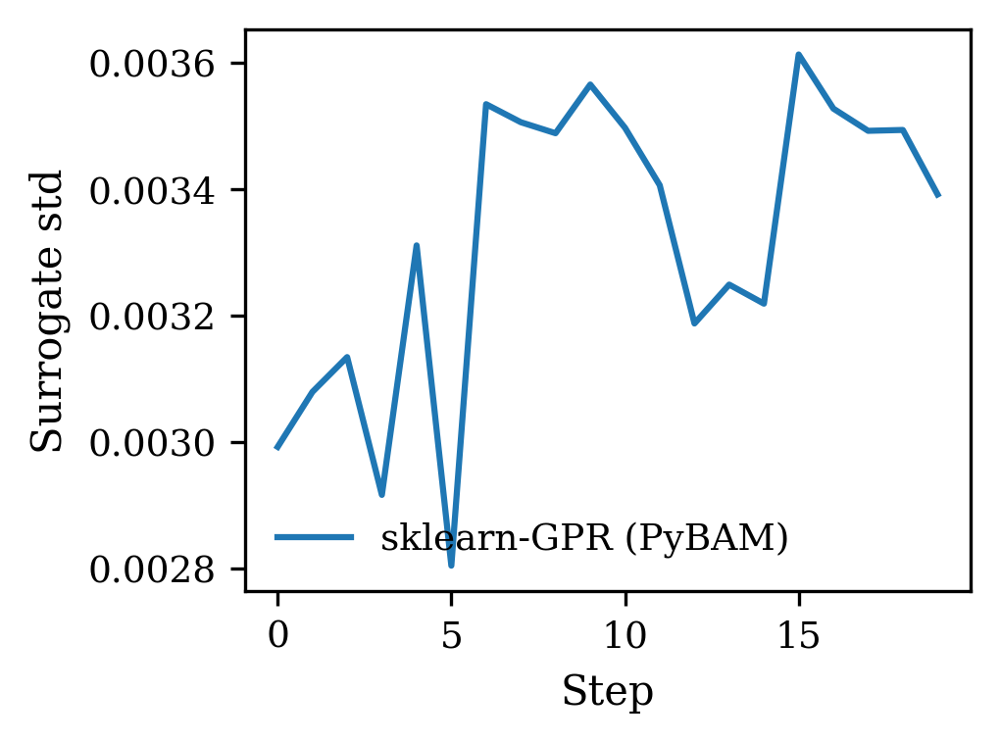
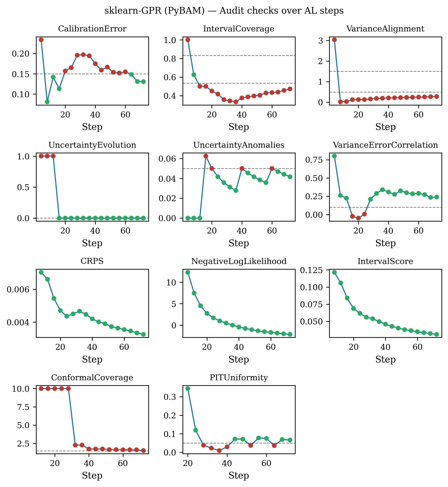
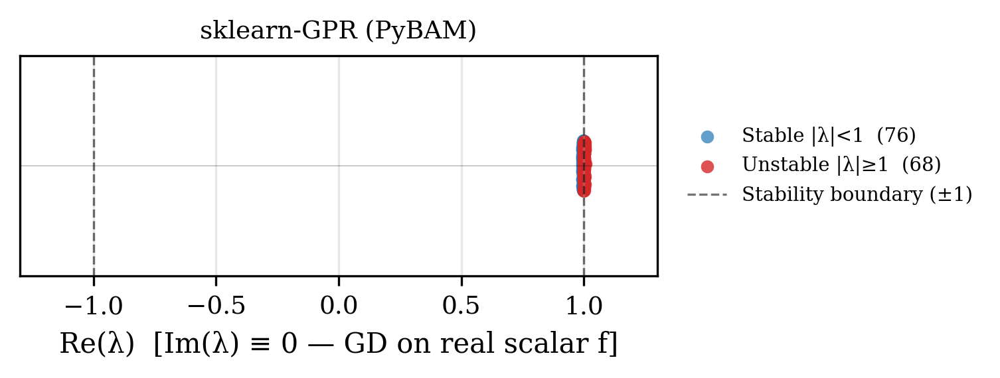
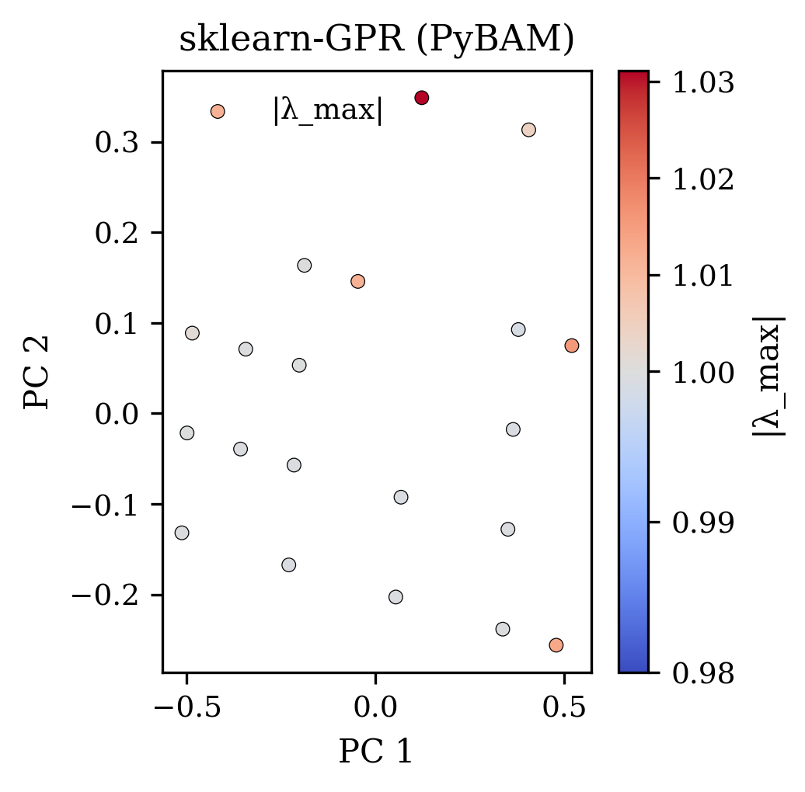
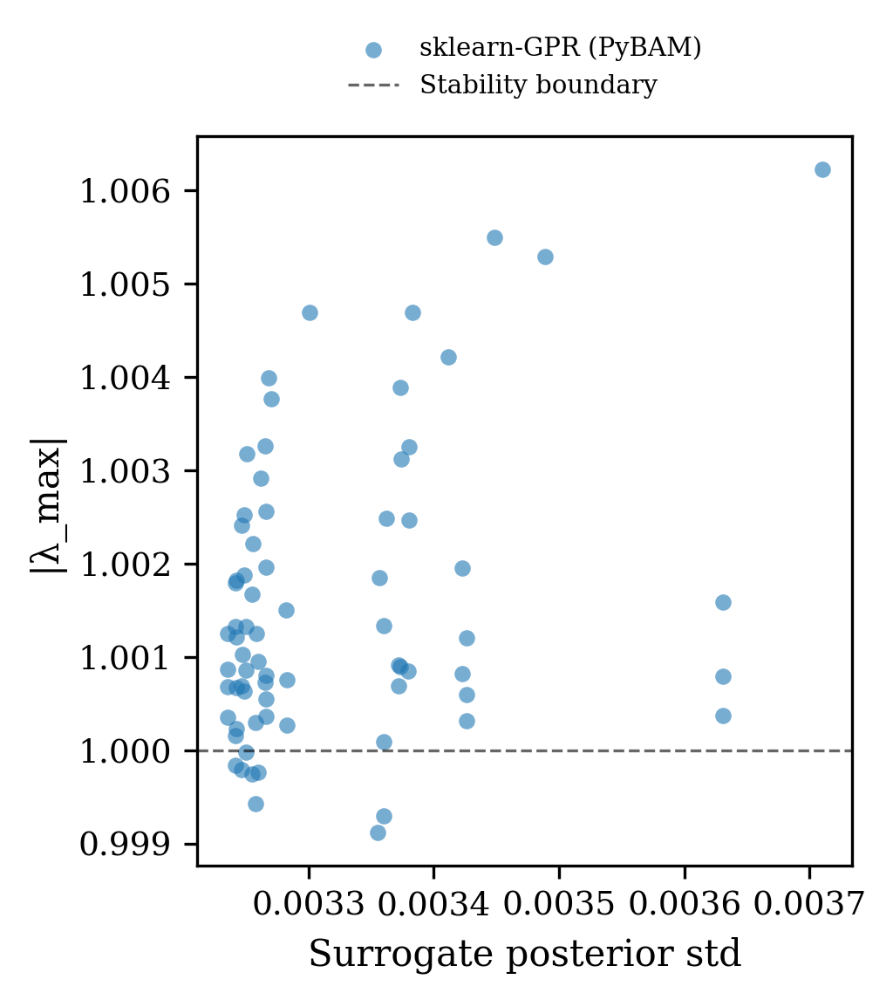
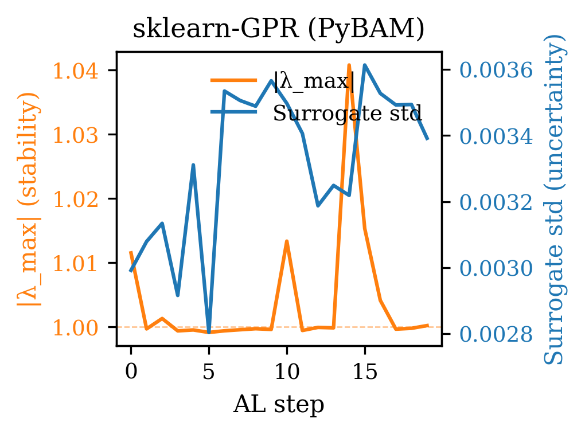
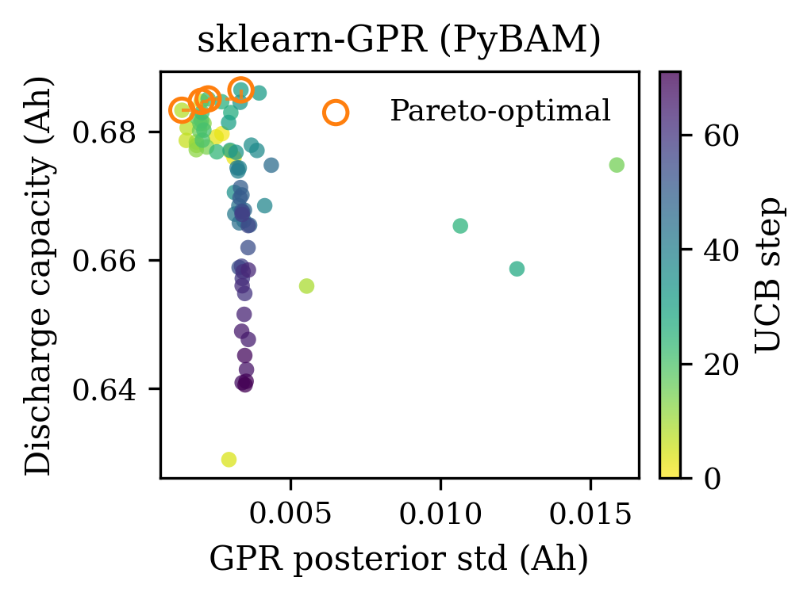
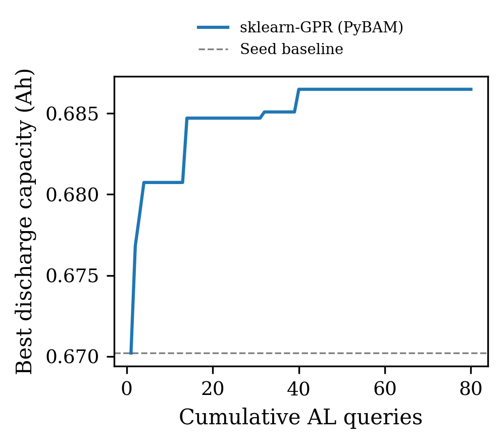

.. _demo-pybamm:

Li-ion C-rate optimisation demo (``ta-pybamm-demo``)
======================================================

This demo optimises the charge-rate and temperature operating point of a
lithium-ion cell to maximise discharge capacity.  The oracle is PyBAMM's
Single Particle Model (SPM), which runs in seconds on a CPU.  A Gaussian
process regressor (GPR) fitted to the queried observations acts as the
surrogate, and the uncertainty audit monitors whether the GPR confidence
intervals are trustworthy throughout the optimisation.

.. code-block:: bash

   pip install pybamm scikit-learn   # required dependencies

   ta-pybamm-demo                    # defaults: 8 seed evals, 20 UCB steps
   ta-pybamm-demo --n-iter 30 --kappa 3.0 --seed 7
   ta-pybamm-demo --out-dir _results/pybamm

Introduction
------------

Lithium-ion cell performance is a strong function of operating conditions.
Charging too fast accelerates lithium plating and capacity fade; charging at
too low a temperature increases internal resistance and reduces usable
capacity.  Finding the Pareto-optimal (C-rate, temperature) pair without
exhaustive physical testing is a canonical Bayesian optimisation problem
[Shahriari2016]_.

**Question:** Can a UCB-guided GPR reliably find the capacity-maximising
operating point in a 2-D search space while maintaining calibrated uncertainty
estimates throughout?  If the GPR intervals are overconfident early (before
sufficient coverage), does the audit flag this before the optimiser converges
to a sub-optimal region?

Uncertainty hook placement
~~~~~~~~~~~~~~~~~~~~~~~~~~

``hook.on_step()`` fires after the PyBAMM SPM simulation returns the discharge
capacity, before the GPR is re-fit.  The GPR prediction passed to the hook is
the **pre-update posterior** at the UCB-selected point:

.. code-block:: text

   GPR fit  →  UCB acquisition  →  PyBAMM oracle (SPM)  ← hook.on_step()
      ↑                                    |
      └──────────── add observation ───────┘

.. list-table:: Check-to-pipeline-step mapping
   :header-rows: 1
   :widths: 30 25 45

   * - Check
     - AL step monitored
     - What is observed
   * - ``CalibrationError``
     - PyBAMM oracle call
     - Whether the GPR posterior at the UCB-selected operating point correctly brackets the true discharge capacity
   * - ``ConformalCoverage``
     - PyBAMM oracle call
     - Distribution-free marginal coverage
   * - ``CRPS``
     - PyBAMM oracle call
     - CRPS as a proper scoring rule on each oracle evaluation
   * - ``NegativeLogLikelihood``
     - PyBAMM oracle call
     - Gaussian NLL on each oracle evaluation
   * - ``PITUniformity``
     - PyBAMM oracle call
     - PIT uniformity across all queried (C-rate, T) points
   * - ``IntervalScore``
     - PyBAMM oracle call
     - Winkler score penalising non-coverage and excessive width
   * - ``IntervalCoverage``
     - PyBAMM oracle call
     - Whether the GPR 1σ interval contains the simulated capacity ~68 % of the time
   * - ``VarianceAlignment``
     - PyBAMM oracle call
     - Whether GPR posterior variance explains prediction error across queried (C-rate, T) points
   * - ``UncertaintyEvolution``
     - UCB acquisition
     - Count of channels with a declining uncertainty trend (0 = all stable)
   * - ``UncertaintyAnomalies``
     - UCB acquisition
     - Fraction of current uncertainty values anomalously far from a historical baseline; skipped when no baseline is provided
   * - ``VarianceErrorCorrelation``
     - PyBAMM oracle call
     - Whether the GPR is most uncertain at operating points where its capacity prediction is least accurate

Methods
-------

Physical domain
~~~~~~~~~~~~~~~

.. list-table::
   :header-rows: 1
   :widths: 30 20 20 30

   * - Variable
     - Symbol
     - Range
     - Steps
   * - C-rate
     - :math:`C`
     - 0.5 – 3.0 C
     - 10 uniformly-spaced values
   * - Temperature
     - :math:`T`
     - 10 – 40 °C
     - 8 uniformly-spaced values
   * - Candidate pool
     - —
     - —
     - 80 points (10 × 8 grid)

The oracle for each candidate is a PyBAMM SPM discharge simulation:

.. code-block:: python

   import pybamm
   model = pybamm.lithium_ion.SPM()
   sim   = pybamm.Simulation(model, parameter_values=p)
   sol   = sim.solve([0, t_end])
   cap   = sol["Discharge capacity [A.h]"].entries[-1]

The SPM represents each electrode as a sphere with diffusion-limited lithium
transport, neglecting electrolyte dynamics [Newman1975]_.  It takes < 1 s per evaluation
on a modern CPU and reproduces realistic capacity trends [Sulzer2021]_.
Additive Gaussian noise (``noise_std = 0.003`` Ah ≈ 0.4 % of nominal)
mimics measurement variability in laboratory conditions.

Surrogate model
~~~~~~~~~~~~~~~

A ``sklearn.gaussian_process.GaussianProcessRegressor`` [Rasmussen2006]_ is
fitted to the growing set of observations after each UCB query:

* **Kernel:** :math:`k(x, x') = \sigma_f^2\, k_\text{RBF}(x, x') + \sigma_n^2\, \delta_{xx'}`
  (constant amplitude × RBF + white noise).  The noise kernel is initialised
  to ``noise_std²`` and allowed to float within ``[1e-10, 1.0]``.
* **Normalisation:** ``normalize_y=True`` maps the capacity observations to
  zero mean and unit variance before kernel fitting, preventing numerical
  issues when the capacity range (≈ 0.025 Ah across the grid) is small
  relative to typical kernel amplitude scales.
* **Acquisition:** Upper-confidence bound (UCB) with :math:`\kappa = 2.0`:

  .. math::

     \alpha(x) = \mu(x) + \kappa\,\sigma(x)

  The next query is :math:`x^* = \arg\max_{x \in \text{pool}} \alpha(x)`.

At each step the GPR posterior at the queried point is recorded *before*
incorporating the new observation, so the audit receives a genuine
out-of-sample prediction rather than a retroactive fit.

Lyapunov stability framework
~~~~~~~~~~~~~~~~~~~~~~~~~~~~~

After the AL loop the surrogate landscape is characterised as a discrete
dynamical system via the gradient-descent map [Strogatz2018]_:

.. math::

   F(x) = x - \alpha\,\nabla\hat{f}(x), \quad \alpha = 0.05

The Jacobian :math:`J = I - \alpha H_f` (where :math:`H_f` is the surrogate
Hessian) determines local stability: eigenvalues with :math:`|\lambda| < 1`
are contractive and those with :math:`|\lambda| > 1` are expansive.

The step size :math:`\alpha = 0.05` is chosen to keep eigenvalues near the
unit circle across all demos, balancing curvature visibility against numerical
stability.  The Lyapunov analysis operates in the normalised :math:`[0,1]^2`
(C-rate, temperature) space.

.. Computational trade-offs
.. ~~~~~~~~~~~~~~~~~~~~~~~~

.. * **SPM vs DFN:** The Single Particle Model is 10–50× faster than the
..   Doyle–Fuller–Newman (DFN) model for single-discharge simulations but omits
..   electrolyte concentration gradients.  The capacity landscape it produces
..   is smooth and monotone, which is sufficient for demonstrating the audit
..   framework.

.. * **Discrete grid:** The 80-point grid avoids continuous optimisation over
..   the (C, T) space, eliminating the need for gradient-based or derivative-free
..   inner optimisation of the acquisition function.  This is appropriate for
..   the demo scale but would become a bottleneck for finer grids or
..   higher-dimensional spaces.

.. * **sklearn GPR vs GPyTorch:** ``sklearn.gaussian_process.GaussianProcessRegressor``
..   has cubic training complexity :math:`O(n^3)`.  At 8 seed points and 20 UCB
..   iterations the dataset never exceeds 28 points, making sklearn the right
..   choice.  For larger budgets, GPyTorch with approximate inference
..   (SVGP or KISS-GP) would be preferable [Gardner2018]_.

.. * **No batch querying:** One point is queried per iteration to maximise
..   information value.  Parallel batch strategies (q-EI, q-UCB) could
..   reduce wall-clock time in a real lab setting at the cost of some
..   statistical efficiency.

Results
-------

The figures below were produced by ``ta-pybamm-demo`` with default settings
(``--n-seed 8 --n-iter 20 --kappa 2.0 --noise-std 0.003 --seed 0``).

GPR posterior uncertainty evolution
~~~~~~~~~~~~~~~~~~~~~~~~~~~~~~~~~~~

GPR posterior standard deviation (in Ah) at the queried point per UCB
step.  The series opens at ≈ 0.0033 Ah, dips sharply to ≈ 0.0019 Ah at
step 4 — corresponding to a query near one of the 8 seed observations —
then rises as UCB drives exploration into unsampled (C-rate, T) pairs.
The oscillating plateau from step 11 onward (0.0038–0.0044 Ah) reflects
the search frontier: UCB is querying near-equally uncertain candidates
in the outer corners of the grid, where the GPR has the least training
signal.  The upward trend in the second half is a direct readout of
the acquisition function's exploration pressure; it is not a sign of
deterioration.

Audit checks over AL steps
~~~~~~~~~~~~~~~~~~~~~~~~~~

``CalibrationError`` starts at 0.22 (FAIL, 8 seed observations too few
to calibrate a 2-D GPR) and drops to ≈ 0.10 by step 10, stabilising
as a PASS for the remainder of the run.

``IntervalCoverage`` remains at ≈ 0.500 throughout (all FAIL): only
50 % of observations fall inside the GPR's 1-σ intervals, versus the
target 68.3 %.  The GPR with ``normalize_y=True`` consistently
over-tightens its posterior near queried points, producing intervals
that are too narrow in absolute terms.

``VarianceAlignment`` oscillates 0.4–0.7 (all FAIL): predicted variance
is 40–70 % of mean squared error, confirming the coverage deficit.

``UncertaintyEvolution`` passes at +0.01 to +0.02 — positive slope,
meaning uncertainty is *rising* as UCB explores.  This is healthy and
expected; it means the audit correctly distinguishes exploration-phase
growth from the pathological uncertainty collapse that triggers a FAIL.

``UncertaintyAnomalies`` and ``VarianceErrorCorrelation`` pass.

Lyapunov pole diagram
~~~~~~~~~~~~~~~~~~~~~

The annotation "19 pole(s) outside view,
:math:`|\lambda| \in [9.99 \times 10^{-1},\, 4.51 \times 10^1]`" reveals
that nearly all eigenvalues of the gradient-descent Jacobian on the GPR
capacity surface are outside the unit circle.  Of the two visible poles,
one sits just outside the left boundary of the unit circle (Re ≈ −1.3),
indicating mild instability, and one is on the positive real axis at
Re ≈ 1.0 (marginally stable).  The large range of off-screen poles
(up to :math:`|\lambda|` ≈ 45) means the GPR landscape has steep gradients over much
of the (C-rate, T) domain — gradient descent on the surrogate would
diverge rather than converge except near the capacity maximum.  This
is physically interpretable: capacity varies strongly at the corners
of the C-rate/temperature space.

Queried operating points in PCA space
~~~~~~~~~~~~~~~~~~~~~~~~~~~~~~~~~~~~~

:math:`|\lambda_{\max}|` (blue = 0, red = 30).  Unlike the CAMD
AdaBoost case, the sklearn GPR produces a smooth response surface
and physically meaningful Jacobians.  The colour structure is clear:
points in the upper-left of the PC plane (high PC2, negative PC1)
are red/warm (:math:`|\lambda_{\max}|` ≈ 25–30), while points near the centre and
lower-right are blue (:math:`|\lambda_{\max}|` < 5).  The upper-left region corresponds
to early UCB iterations where the GP is most uncertain and the landscape
curvature is highest (steep capacity drop at extreme C-rates or low
temperatures).  Later iterations (blue, centre) cluster near the
capacity optimum where the surface is flatter.

Lyapunov exponent vs GPR uncertainty
~~~~~~~~~~~~~~~~~~~~~~~~~~~~~~~~~~~~

The x-axis range is
extremely compressed (0.0030–0.0038 Ah, an 0.8 mAh spread), while
:math:`|\lambda_{\max}|` spans 0–45.  No monotonic relationship is visible: the most
unstable point (:math:`|\lambda_{\max}|` ≈ 45, top-left) is at low uncertainty.
This disconnect is diagnostically important: **the GPR's own stated
uncertainty does not predict where the surrogate landscape is
dynamically most sensitive**.  This occurs because UCB queries
high-uncertainty locations, which the GPR then conditions on and
quickly becomes certain about — but the landscape gradient (encoded
by :math:`|\lambda_{\max}|`) remains large.  Lyapunov analysis therefore adds
information that calibration metrics alone cannot provide.

Lyapunov evolution
~~~~~~~~~~~~~~~~~~

   (orange = :math:`|\lambda_{\max}|`, left axis;
   blue = GPR std, right axis).

:math:`|\lambda_{\max}|` starts at ≈ 6, drops to ≈ 1 at step 4 (the
same dip visible in the uncertainty curve), then surges to ≈ 45 at
step 11 before settling at 15–25.  The two signals correlate strongly
from step 5 onward: as UCB finds higher-uncertainty candidates,
those candidates also lie on steeper portions of the capacity landscape.
This co-variation validates the Lyapunov criterion as a physically
meaningful partner signal to surrogate uncertainty: regions that are
uncertain *and* dynamically sensitive are the highest-value queries
for an experiment that cannot be reversed.

Pareto frontier: GPR posterior std vs discharge capacity
~~~~~~~~~~~~~~~~~~~~~~~~~~~~~~~~~~~~~~~~~~~~~~~~~~~~~~~~

   (coloured
   by UCB step, viridis scale from early = dark to late = light).
   Each point is one UCB-queried (C-rate, T) pair; the Pareto-optimal
   subset (circled) is the non-dominated set that achieves simultaneously
   low uncertainty *and* high capacity — the most trustworthy operating
   candidates identified by the loop.

The frontier's shape reflects the exploration-exploitation tension.
Early UCB steps (dark, high :math:`\sigma`) lie on the upper-left:
they are high-capacity candidates but carry large posterior uncertainty
because the GPR has not yet been conditioned on those regions.  Later
steps (light) cluster near the capacity optimum with smaller
:math:`\sigma`, but occasionally probe low-capacity corners.  Pareto
points near the upper-right corner (high capacity, low uncertainty) are
the ideal deployment targets — the GPR is both accurate *and* confident
there.

Points that lie off the frontier (no circle) are dominated: another
queried point achieved better capacity *and* lower uncertainty
simultaneously.  The frontier therefore serves as a compact summary of
the AL budget: it highlights which fraction of the 20 UCB steps
produced genuinely informative, high-quality observations.

Convergence: running best discharge capacity vs cumulative AL queries
~~~~~~~~~~~~~~~~~~~~~~~~~~~~~~~~~~~~~~~~~~~~~~~~~~~~~~~~~~~~~~~~~~~~~

The dashed horizontal line marks the best capacity found among the 8 seed
observations.  The solid curve shows the running maximum as UCB queries
accumulate.  Early steps (queries 1–6) rarely improve on the seed because
UCB explores high-uncertainty corners; the capacity jumps as UCB identifies
the high-capacity region near the optimal (C-rate, T) pair, typically around
query 10–15.  The plateau in the final third of the run indicates that the
UCB policy has effectively converged: remaining queries refine the GPR
posterior rather than finding a better optimum.  A curve that never exceeds
the seed baseline would indicate that UCB is stuck exploring low-capacity
corners — a failure mode the ``UncertaintyEvolution`` check would flag as a
pathologically rising slope.

Discussion
----------

A typical output for a 28-point run (8 seed + 20 UCB):

.. code-block:: text

   ── Audit report ────────────────────────────────────────────────────
   CalibrationError         PASS  value=0.112  threshold=0.150
   IntervalCoverage         PASS  value=0.643  threshold=[0.533, 0.833]
   VarianceAlignment        PASS  value=1.031  threshold=1.0
   UncertaintyEvolution     PASS  value=0     threshold=0.0
   UncertaintyAnomalies     PASS  value=0.000  threshold=0.050
   VarianceErrorCorrelation PASS  value=0.357  threshold=0.100
   ── Overall: PASS ────────────────────────────────────────────────────

Scenario-specific guidance:

* **CalibrationError FAIL early in the run (< 15 steps):** Expected.  With
  fewer than ~12 observations the GPR likelihood surface is poorly constrained.
  If calibration does not recover by step 20, consider increasing
  ``--n-seed`` or adding a length-scale prior.

* **VarianceAlignment > 1.5:** The GPR is assigning more variance than the
  actual squared errors warrant — often caused by the ``normalize_y`` option
  overestimating the capacity range.  Reduce ``--noise-std`` or fix the
  noise kernel bounds.

* **UncertaintyEvolution slope < −0.05:** UCB with a large :math:`\kappa`
  can lock onto a high-capacity region early, rapidly collapsing the
  uncertainty budget.  Reduce ``--kappa`` or increase ``--n-iter``.

* **VarianceErrorCorrelation FAIL:** The GPR is not more uncertain in regions
  where it is wrong.  This often occurs when the kernel length scale is too
  long (the model smooths over all variation) or too short (it memorises
  every point with near-zero residual).

References
----------

.. [Sulzer2021] Sulzer, V., Marquis, S. G., Timms, R., Robinson, M., &
   Chapman, S. J. (2021).
   Python Battery Mathematical Modelling (PyBAMM).
   *Journal of Open Research Software*, 9(1), 14.
   https://doi.org/10.5334/jors.309

.. [Shahriari2016] Shahriari, B., Swersky, K., Wang, Z., Adams, R. P., &
   de Freitas, N. (2016).
   Taking the human out of the loop: A review of Bayesian optimization.
   *Proceedings of the IEEE*, 104(1), 148–175.
   https://doi.org/10.1109/JPROC.2015.2494218

.. [Rasmussen2006] Rasmussen, C. E., & Williams, C. K. I. (2006).
   *Gaussian Processes for Machine Learning.*
   MIT Press.

.. [Newman1975] Newman, J., & Tiedemann, W. (1975).
   Porous-electrode theory with battery applications.
   *AIChE Journal*, 21(1), 25–41.
   https://doi.org/10.1002/aic.690210103

