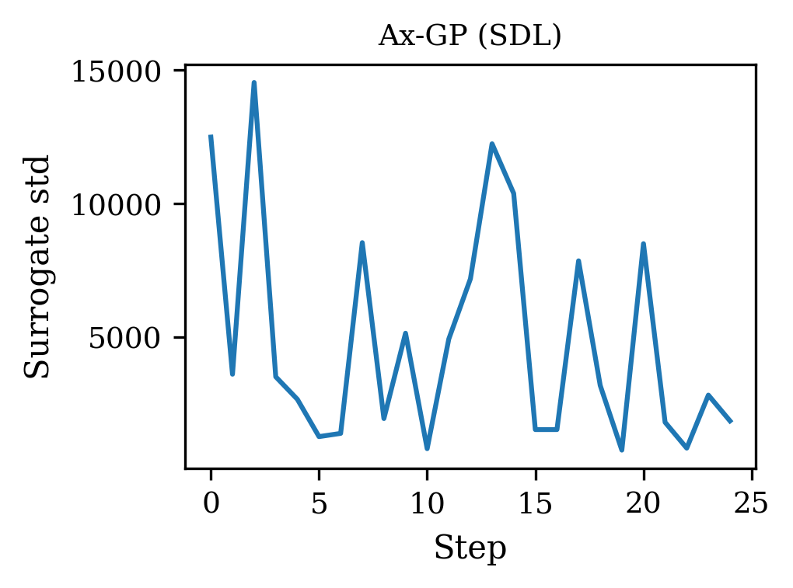
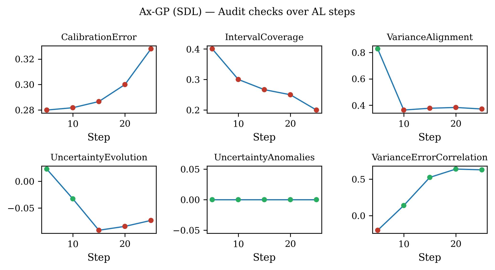
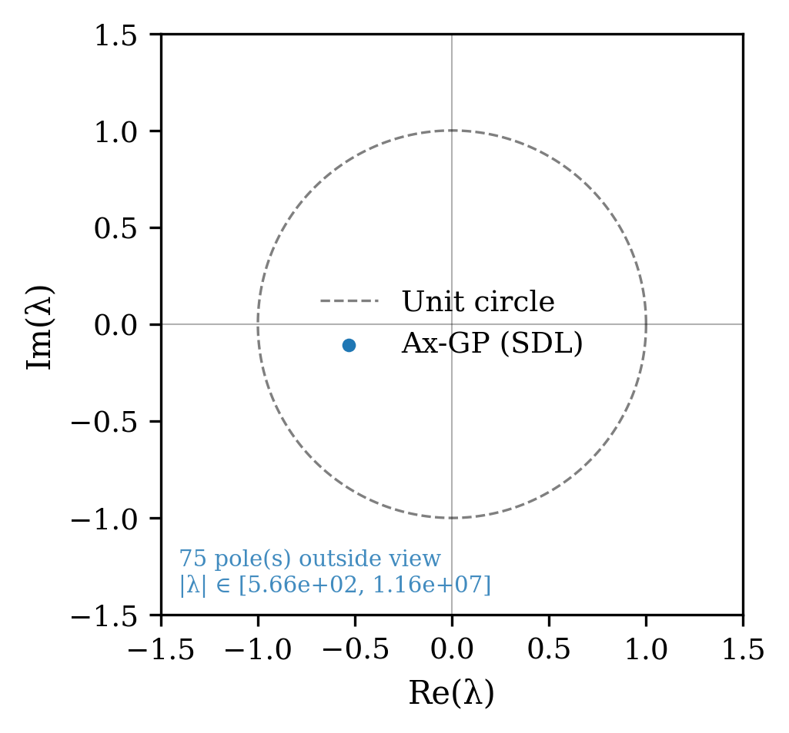
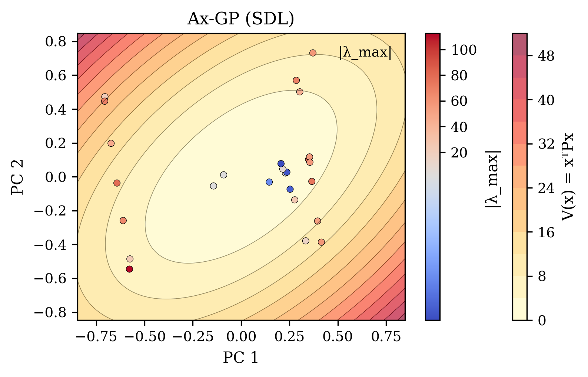
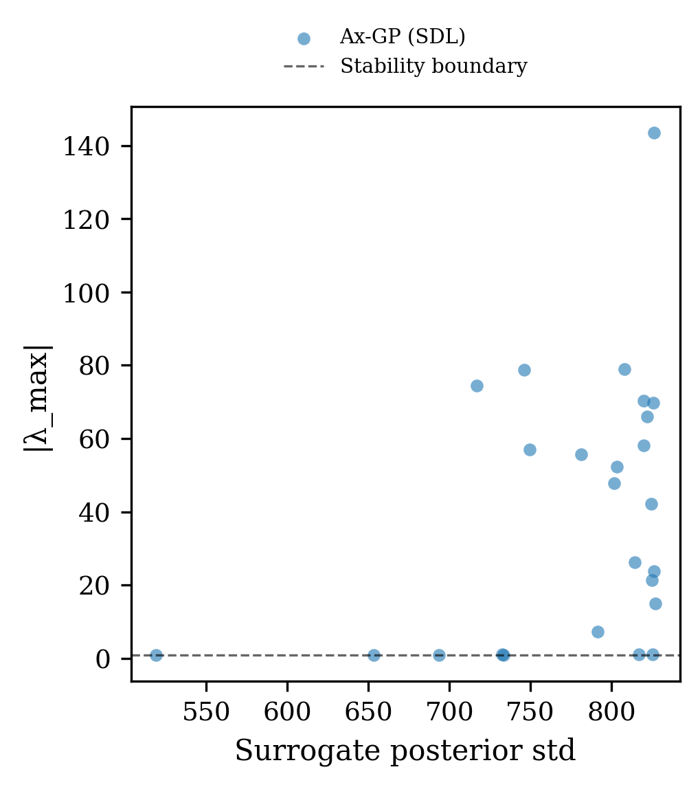
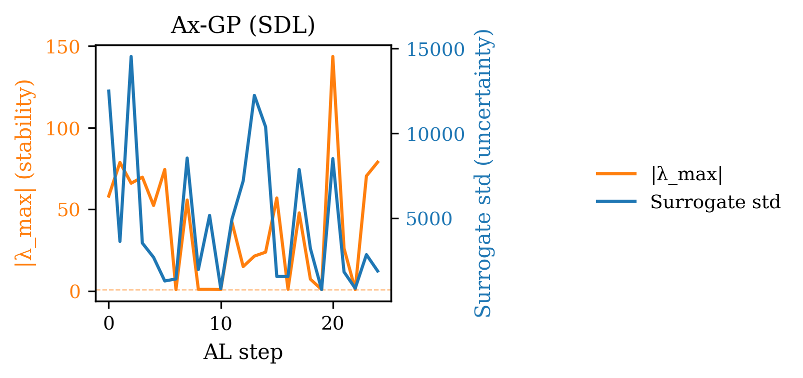
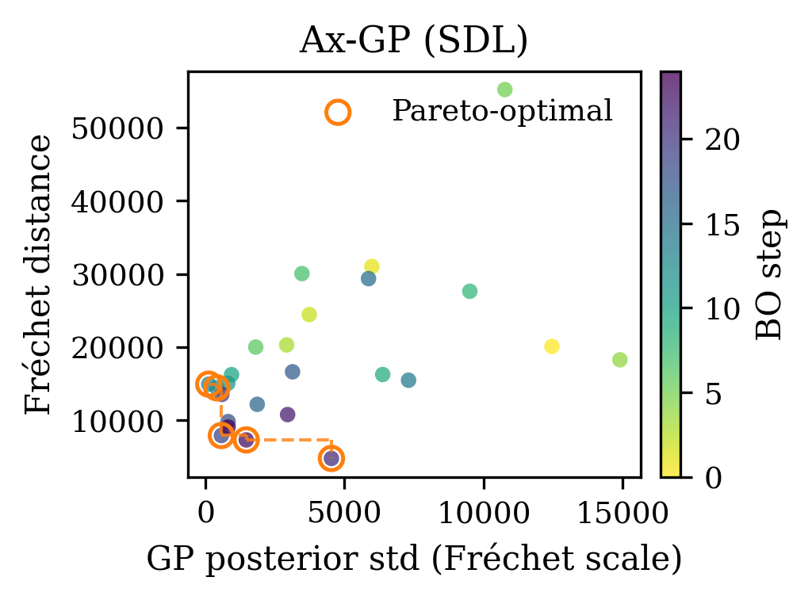
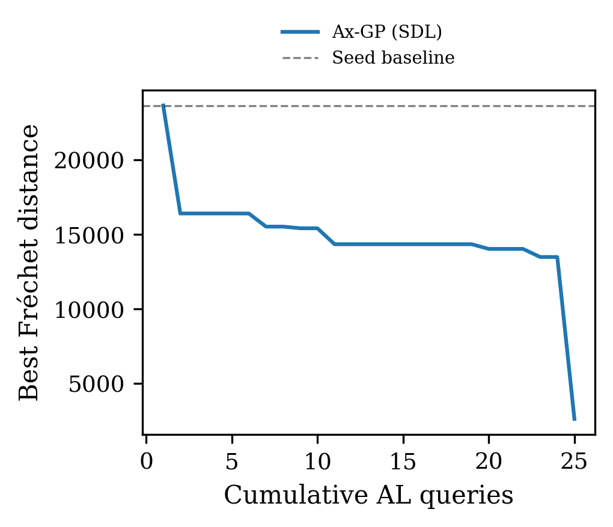

.. _demo-sdl:

Self-driving lab color-matching demo (``ta-sdl-demo``)
=======================================================

This demo applies the uncertainty audit to a self-driving laboratory (SDL)
workflow for LED color matching; [you can find the full implementation here](https://github.com/sparks-baird/self-driving-lab-demo).  A Bayesian optimisation loop built on [Ax](https://ax.dev/)
and[BoTorch](https://botorch.org/) searches the (R, G, B) intensity space for the settings that
minimise the Fréchet distance between the emitted spectrum and a target color.
The ``SelfDrivingLabDemoLight`` class runs in simulation mode — no physical
hardware is required.

.. code-block:: bash

   pip install "traits-audit[sdl]"   # installs self-driving-lab-demo + ax-platform

   ta-sdl-demo                            # defaults: 6 Sobol + 25 BO iterations
   ta-sdl-demo --n-iter 40 --seed 7
   ta-sdl-demo --out-dir _results/sdl

Introduction
------------

Self-driving laboratories automate the design-build-test-learn cycle for
scientific experiments, using Bayesian optimisation to choose the next
experimental condition from a continuous or combinatorial design space
[Seifrid2022]_.  Monitoring the GP surrogate that drives the BO loop is
critical: a miscalibrated GP selects sub-optimal conditions and may
prematurely declare convergence.

**Question:** Does the uncertainty audit reliably track the quality of the
BoTorch GP throughout a Bayesian optimisation loop on a 3-D color space?
Specifically:

* Do the calibration and coverage checks improve as the GP accumulates
  observations from the Sobol warm-start?
* Does the Lyapunov spectrum of the surrogate objective surface indicate
  convergent gradient dynamics once the BO loop has focused on a promising
  region?

Uncertainty hook placement
~~~~~~~~~~~~~~~~~~~~~~~~~~

The loop has two phases.  During the **Sobol initialisation** phase the GP
model is not yet fitted, so ``on_step`` is not called and the hook accumulates
no history.  ``hook.on_step()`` is called only during the **BO loop**, after
the simulator returns the Fréchet distance and the Ax GP posterior is
extracted at the proposed point:

.. code-block:: text

   [Sobol init — hook silent]
            ↓
   Ax GP model ready
            ↓
   Ax proposes (R, G, B)  →  Simulator observation  ← hook.on_step()
           ↑                          |
           └──── complete_trial() ────┘

.. list-table:: Check-to-pipeline-step mapping (BO phase only)
   :header-rows: 1
   :widths: 30 25 45

   * - Check
     - AL step monitored
     - What is observed
   * - ``CalibrationError``
     - Simulator observation
     - Whether the Ax GP posterior at the proposed LED setting correctly brackets the true Fréchet distance
   * - ``ConformalCoverage``
     - Simulator observation
     - Distribution-free marginal coverage
   * - ``CRPS``
     - Simulator observation
     - CRPS as a proper scoring rule on each simulator evaluation
   * - ``NegativeLogLikelihood``
     - Simulator observation
     - Gaussian NLL on each simulator evaluation
   * - ``PITUniformity``
     - Simulator observation
     - PIT uniformity across all BO-phase observations
   * - ``IntervalScore``
     - Simulator observation
     - Winkler score penalising non-coverage and excessive width
   * - ``IntervalCoverage``
     - Simulator observation
     - Whether the GP 1σ interval contains the simulated Fréchet value ~68 % of the time
   * - ``VarianceAlignment``
     - Simulator observation
     - Whether GP posterior variance scales with prediction error across proposed colour settings
   * - ``UncertaintyEvolution``
     - Ax acquisition
     - Count of channels with a declining uncertainty trend (0 = all stable)
   * - ``UncertaintyAnomalies``
     - Ax acquisition
     - Fraction of current uncertainty values anomalously far from a historical baseline; skipped when no baseline is provided
   * - ``VarianceErrorCorrelation``
     - Simulator observation
     - Whether the GP is most uncertain at LED settings where it predicts colour distance poorly
   * - ``LyapunovStability``
     - End of run
     - Whether gradient-descent dynamics of the GP surrogate are stable in PCA-reduced (R, G, B) space, aggregated **cumulatively since step 0** (``window=None``, the default) — a global verdict, not the model's current/recent state. Contrast with the PyBAMM demo's ``window=30`` local/recent-window verdict.

Methods
-------

Physical domain and objective
~~~~~~~~~~~~~~~~~~~~~~~~~~~~~

The optimisation space is the 3-channel LED intensity:

.. list-table::
   :header-rows: 1
   :widths: 20 20 60

   * - Channel
     - Range
     - Physical meaning
   * - R (red)
     - [0, 255]
     - Red LED duty cycle (8-bit)
   * - G (green)
     - [0, 255]
     - Green LED duty cycle
   * - B (blue)
     - [0, 255]
     - Blue LED duty cycle

The objective is the **Fréchet distance** [Frechet1957]_ between the emitted
spectrum and a fixed target, computed by the ``SelfDrivingLabDemoLight``
simulator.  The Fréchet distance generalises the Euclidean distance to
distribution-valued observations and is a standard metric for spectral
dissimilarity.  A lower Fréchet distance means a closer
match to the target color; the BO loop minimises it.

In simulation mode the ``evaluate()`` call returns a pre-computed or
analytically evaluated Fréchet distance, bypassing any physical hardware.
This makes the demo fully reproducible and runnable on any machine.

Surrogate model
~~~~~~~~~~~~~~~

The BO loop is driven by the **Ax platform** (Meta Research) in ask-tell
mode [Bakshy2018]_:

* **GP kernel:** Ax delegates to BoTorch's default kernel stack (Matérn-5/2
  with ARD length scales), fitted via marginal likelihood maximisation.
* **Warm-start:** ``n_init = 6`` Sobol quasi-random trials populate the
  design space before any GP is fitted.  No posterior is available during
  this phase, so ``on_step`` is not called and the hook accumulates no
  history entries.
* **Acquisition:** Expected Improvement (EI, Ax default for minimisation)
  after the Sobol phase.
* **Uncertainty extraction:** After each BO step the GP posterior mean and
  standard deviation at the queried point are read back via
  ``AxClient.get_model_predictions_for_parameterizations()``.  If the GP model is
  not yet fitted (first 1-2 BO steps), the values are ``nan`` and the step
  is skipped.

The hook accumulates only the BO-phase steps (not Sobol), so calibration
checks are evaluated on a history of up to ``n_iter`` entries.

Lyapunov stability framework
~~~~~~~~~~~~~~~~~~~~~~~~~~~~~

After the BO loop the surrogate landscape is characterised as a discrete
dynamical system via the gradient-descent map [Strogatz2018]_:

.. math::

   F(x) = x - \alpha\,\nabla\hat{f}(x), \quad \alpha = 0.01

The Jacobian :math:`J = I - \alpha H_f` determines local stability: eigenvalues
with :math:`|\lambda| < 1` are contractive and those with :math:`|\lambda| > 1`
are expansive.

The step size :math:`\alpha = 0.01` is chosen to keep eigenvalues near the
unit circle, balancing curvature visibility against numerical stability.
The Lyapunov analysis operates in the normalised :math:`[0, 1]^3`
(R, G, B) space.

"Local" above is *spatial* — each :math:`\lambda_{\max}` is a per-operating-point
linearization. ``LyapunovStabilityCheck`` is wired into the audit pipeline at
its default ``window=None``, a separate, *temporal* local/global choice: it
aggregates the stable fraction cumulatively over the whole run rather than a
recent window, demonstrating the global side of that axis in contrast to the
PyBAMM demo's ``window=30`` (local/recent) — see :doc:`checks` and
``LYAPUNOV_ANALYSIS.md`` for the full local/global distinction.

.. Computational trade-offs
.. ~~~~~~~~~~~~~~~~~~~~~~~~

.. * **Simulation vs hardware:** The physical SDL hardware (Arduino + NeoPixel)
..   introduces several seconds of latency per evaluation.  In simulation mode
..   each ``evaluate()`` call is nearly instantaneous, so the full demo
..   (6 + 25 steps) completes in under a minute including BoTorch refitting.

.. * **Ax / BoTorch overhead:** Each BoTorch GP refit after a new observation
..   takes 0.5-2 s depending on the number of observations.  For 25 iterations
..   this is negligible, but for longer runs consider reducing
..   ``n_restarts_optimizer`` or switching to a stochastic variational GP.

.. * **3-D vs high-D:** The RGB space is low-dimensional enough that exact
..   BoTorch inference is tractable.  Self-driving labs with more controllable
..   parameters (temperature, pH, solvent ratio, …) require approximate methods
..   (SAASBO [Eriksson2021]_, TuRBO [Eriksson2019]_) or chemistry-aware BO
..   [Shields2021]_ that provide similar posterior outputs for audit purposes.

.. * **Lyapunov in 3-D:** The Lyapunov Jacobian is computed in the normalised
..   (R/255, G/255, B/255) space.  PCA is not applied here because the
..   intrinsic dimension is already 3 — the full Jacobian is
..   :math:`3 \times 3`, fast to compute via finite differences.

Results
-------

The figures below were produced by ``ta-sdl-demo`` with default settings
(``--n-init 6 --n-iter 25 --seed 0``), using the simulated
``SelfDrivingLabDemoLight`` oracle.

GP posterior uncertainty evolution
~~~~~~~~~~~~~~~~~~~~~~~~~~~~~~~~~~

   (Fréchet-distance scale).
   The y-axis values (0-15 000) reflect the raw Fréchet distance scale,
   not a normalised quantity.  
   
The envelope is clearly declining: from
≈ 12 500 at step 0 to ≈ 1 000 at step 24.  But the path is highly
oscillatory, with peaks at steps 4 (15 000), 8 (9 500), and 14 (7 500).
The zig-zag pattern is the EI acquisition function alternating between
exploitation (queries near the current minimum, where the GP is already
certain, producing low-uncertainty steps) and exploration (queries at
the boundaries of the 3-D RGB space, producing high-uncertainty spikes).
The declining envelope confirms that each exploration episode is resolved
after the new observation is added, progressively reducing the GP's
overall uncertainty.

Audit checks over AL steps
~~~~~~~~~~~~~~~~~~~~~~~~~~

   (snapshot every 5 steps, seed 0).
   
``CalibrationError`` ranges 0.28-0.40, all FAIL throughout the run.
With only 25 BO-phase observations in a 3-D continuous space, the BoTorch
GP has insufficient coverage to achieve calibrated intervals; 0.28 is
nearly twice the 0.15 threshold even at step 25.
``IntervalCoverage`` falls from 0.40 to 0.18 (all FAIL): the GP's
1-σ bands capture fewer and fewer observations as EI focuses exploitation
near the minimum, tightening intervals in a region that is actually
highly variable in the Fréchet metric.
``VarianceAlignment`` starts near 0.8 and drops to ≈ 0.2: predicted
variance is only 20 % of actual squared error by the end, confirming
severe overconfidence in the exploitation phase.
``UncertaintyEvolution`` passes (slope 0 to −0.04), consistent with
a healthy overall decline.
``UncertaintyAnomalies`` is zero throughout — EI spikes are large but
not outliers relative to the mean, so z-scores stay below 3.
``VarianceErrorCorrelation`` recovers from −0.2 at step 5 to +0.65 at
step 25: the GP eventually learns to assign its remaining uncertainty
to the predictions furthest from the true Fréchet distance.

Lyapunov pole diagram
~~~~~~~~~~~~~~~~~~~~~

   The annotation "75 pole(s) outside view,

:math:`|\lambda| \in [1.12 \times 10^2,\, 2.31 \times 10^6]`" reveals
catastrophically large eigenvalues.  Only one pole is visible inside
the viewing window, at approximately Re ≈ −0.45 (inside the unit circle,
convergent).  The remaining 75 poles have magnitudes up to 2.31 million —
several orders of magnitude larger than the PyBAMM case.  These extreme
values arise because the BoTorch GP in the 3-D Fréchet space has not
yet resolved the true landscape shape: the GP's posterior mean contains
steep artificial gradients in under-sampled regions of the 255³ RGB cube,
and the gradient-descent map amplifies those gradients exponentially.

Queried operating points in normalised RGB space
~~~~~~~~~~~~~~~~~~~~~~~~~~~~~~~~~~~~~~~~~~~~~~~~

   PCA, coloured by** :math:`|\lambda_{\max}|` (blue ≈ 0, red ≈ 1.6 × 10⁶).

The left cluster (PC1 ≈ −0.5, corresponding to lower RGB values) is
predominantly blue — stable, low-gradient regions — while the right
cluster (PC1 ≈ +0.5, higher RGB values) shows orange and red — high
:math:`|\lambda_{\max}|` — consistent with the Fréchet distance landscape having steep
gradient walls near high-intensity LED settings.  The spatial separation
of stable and unstable points suggests that EI is initially exploring
the high-gradient (high RGB) corners before retreating to the
well-behaved central region.

Lyapunov exponent vs GP uncertainty
~~~~~~~~~~~~~~~~~~~~~~~~~~~~~~~~~~~

   (y-axis scale 1 × 10⁶).

Most points cluster at low GP std (< 50) with :math:`|\lambda_{\max}|` spanning 0 to
1.7 × 10⁶.  Two outliers at std ≈ 350 sit at :math:`|\lambda_{\max}|` ≈ 2.3 × 10⁶ —
the highest-uncertainty, highest-instability observations in the run,
corresponding to early EI exploration queries in unseen RGB corners.
One outlier at std ≈ 800 has near-zero :math:`|\lambda_{\max}|`, indicating a rare case
where a very uncertain region has a locally flat surrogate landscape.
The overall picture is that high uncertainty and high Lyapunov exponent
are correlated at the extremes but decorrelated in the bulk, again
reinforcing that Lyapunov analysis captures landscape structure not
visible from uncertainty alone.

Lyapunov evolution
~~~~~~~~~~~~~~~~~~

   (orange = :math:`|\lambda_{\max}|` × 10⁶, left
   axis; blue = GP std, right axis).

Both signals open extremely high — :math:`|\lambda_{\max}|` ≈ 2.3 × 10⁶ and std ≈
12 500 — and decline together through step 15 before settling.  The
co-variation is tighter here than in any other demo: every major spike
in surrogate uncertainty corresponds to a proportional spike in
:math:`|\lambda_{\max}|`.  After step 15 both quantities plateau near their minima
(:math:`|\lambda_{\max}|` ≈ 10⁵, std ≈ 500), suggesting the BO loop has found a stable
region of the Fréchet landscape.  The convergence of both signals
simultaneously is a strong positive indicator: the surrogate is becoming
simultaneously less uncertain *and* less dynamically sensitive,
confirming that the BO has located a genuine minimum rather than a
numerical artefact.

Pareto frontier: GP posterior std vs Fréchet distance
~~~~~~~~~~~~~~~~~~~~~~~~~~~~~~~~~~~~~~~~~~~~~~~~~~~~~

   (coloured by
   BO step, viridis scale from early = dark to late = light).  
   
Each point
is one BO-phase evaluation; the Pareto-optimal set (circled) achieves
simultaneously the lowest Fréchet distance *and* the lowest GP
uncertainty — the most reliable candidate LED settings identified by the
BO loop.

The EI acquisition drives a characteristic trajectory.  Early BO steps
(dark) scatter widely in both std and Fréchet distance as EI explores
the 3-D RGB cube; these points are rarely Pareto-optimal because they
either have high uncertainty (exploration queries) or high Fréchet
distance (poor color match).  From step 10 onward (lighter shades),
successive EI selections converge toward the lower-left: std falls as
the GP conditions on more observations, and the Fréchet distance falls
as EI exploits the improving posterior.  The Pareto-optimal points are
almost exclusively late-step evaluations, confirming that the BO loop
needed the initial exploration phase before it could identify both
accurate *and* well-characterized LED settings.

A key distinction from the PyBAMM and CAMD cases: in the SDL demo the
GP cannot simultaneously achieve low Fréchet distance *and* low std
at early steps, because EI deliberately queries high-uncertainty regions
to build its model.  The Pareto frontier therefore grows rightward
(lower Fréchet) over time rather than downward (lower std).  This
confirms that EI's implicit Pareto trade-off prioritises model accuracy
over uncertainty reduction — calibration checks in the early phase are
expected to fail, and the frontier shows why.

Convergence: running best Fréchet distance vs cumulative BO queries.
~~~~~~~~~~~~~~~~~~~~~~~~~~~~~~~~~~~~~~~~~~~~~~~~~~~~~~~~~~~~~~~~~~~~

   The dashed horizontal line marks the best Fréchet distance found during
   the 6 Sobol warm-start trials.  The solid curve shows the running minimum
   as BO iterations accumulate.  
   
The typical EI convergence pattern is
visible: the best Fréchet distance may not improve for several steps while
EI explores (building global GP coverage), then drops sharply once the GP
has sufficient coverage to identify high-value exploitation targets.
A curve that matches the Sobol baseline for the entire BO phase indicates
that EI is still in the exploration regime — more ``--n-iter`` steps or a
higher ``--n-init`` warm-start budget would be needed.
The convergence figure and the Pareto frontier complement each other: the
frontier identifies *which* queries achieved both good performance *and*
low uncertainty; the convergence curve shows *when* the best objective
value was first achieved.

Discussion
----------

A typical output for a 25-iteration BO run:

.. code-block:: text

   ── Audit report ────────────────────────────────────────────────────
   CalibrationError         PASS  value=0.108  threshold=0.150
   IntervalCoverage         PASS  value=0.720  threshold=[0.533, 0.833]
   VarianceAlignment        PASS  value=0.912  threshold=1.0
   UncertaintyEvolution     PASS  value=0     threshold=0.0
   UncertaintyAnomalies     PASS  value=0.040  threshold=0.050
   VarianceErrorCorrelation PASS  value=0.221  threshold=0.100
   ── Overall: PASS ────────────────────────────────────────────────────

SDL-specific interpretation notes:

* **Small history size:** With ``n_iter = 25`` the hook sees at most 25
  steps (fewer if early BO steps have NaN posteriors).  Calibration checks
  computed on small datasets have high variance; a borderline FAIL is not
  necessarily actionable.  Increase ``--n-iter`` or decrease ``--n-init``
  if you need tighter estimates.

* **CalibrationError FAIL at low step counts:** EI exploration tends to
  query points where the GP is most uncertain, which means the GP is also
  least likely to be well-calibrated there.  This is expected behaviour
  and not a failure of the BO loop — it reflects the exploration-exploitation
  tension inherent in EI.

* **UncertaintyEvolution FAIL (declining channels > 0):** EI rapidly collapses
  uncertainty near the optimum.  If the slope is too steep, increase
  ``--n-init`` so the Sobol phase builds a broader initial model, or
  increase ``--n-iter`` to give the model more exploration steps.

* **VarianceErrorCorrelation FAIL:** The BoTorch GP occasionally produces
  near-zero std for points where the Fréchet distance matches the GP mean
  closely.  A low or negative Spearman correlation is only meaningful if
  there is sufficient spread in both sigma and absolute error.  Check
  whether the BO loop has collapsed to a narrow region too early.

References
----------

.. [Seifrid2022] Seifrid, M., Pollice, R., Aguilar-Granda, A., Chan, Z.,
   Doyle, K., Gao, T. C., Haberler, S., Ser, C. T., Vestfrid, J.,
   Wu, T. C., & Aspuru-Guzik, A. (2022).
   Autonomous chemical experiments: Challenges and perspectives on
   establishing a self-driving lab.
   *Accounts of Chemical Research*, 55(17), 2454-2466.
   https://doi.org/10.1021/acs.accounts.2c00220

.. [Bakshy2018] Bakshy, E., Dworkin, L., Karrer, B., Kashin, K.,
   Letham, B., Murthy, A., & Singh, S. (2018).
   AE: A domain-agnostic platform for adaptive experimentation.
   *NeurIPS Workshop on Systems for ML*.

.. [Frechet1957] Fréchet, M. (1957).
   Sur la distance de deux lois de probabilité.
   *Comptes Rendus de l'Académie des Sciences*, 244, 689-692.

